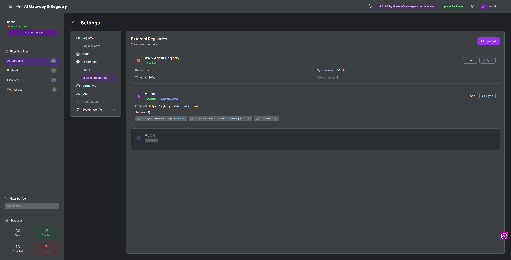
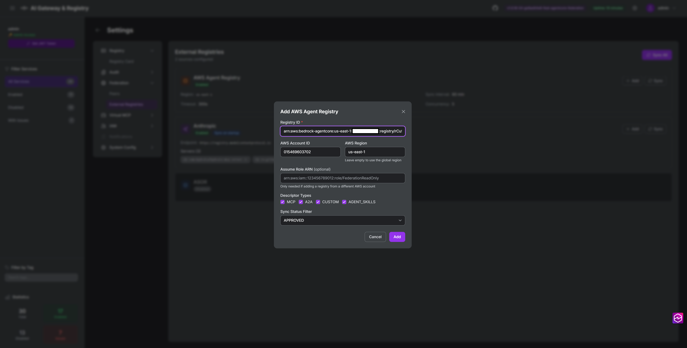
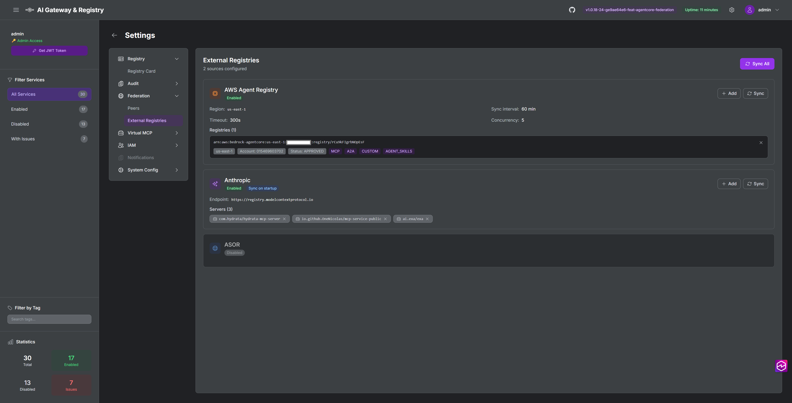
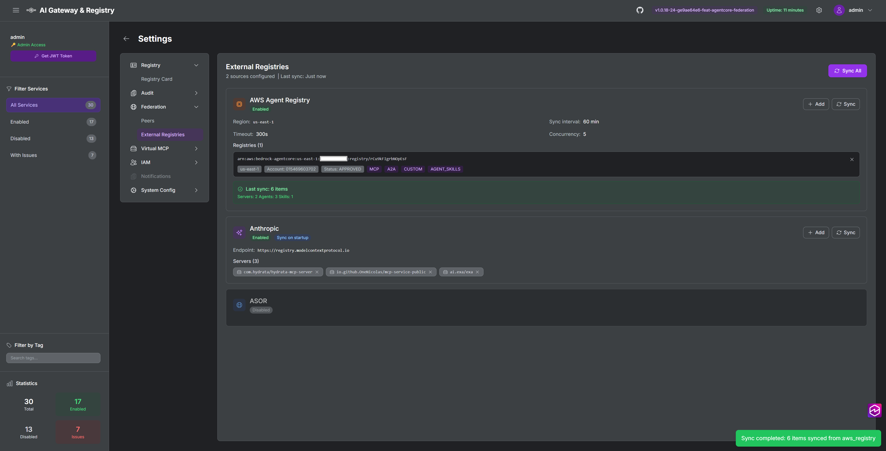
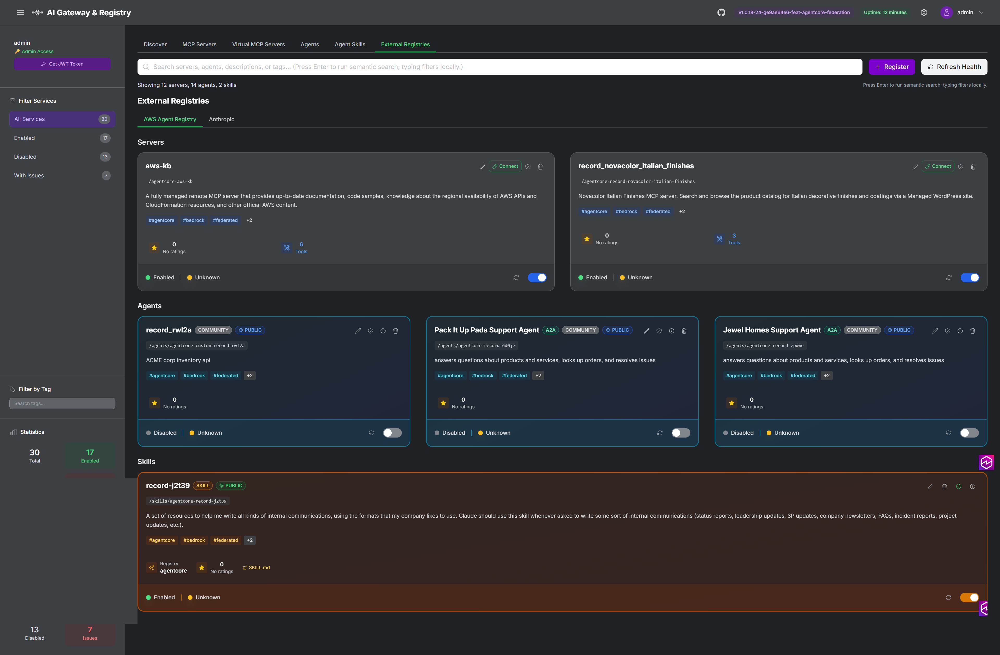
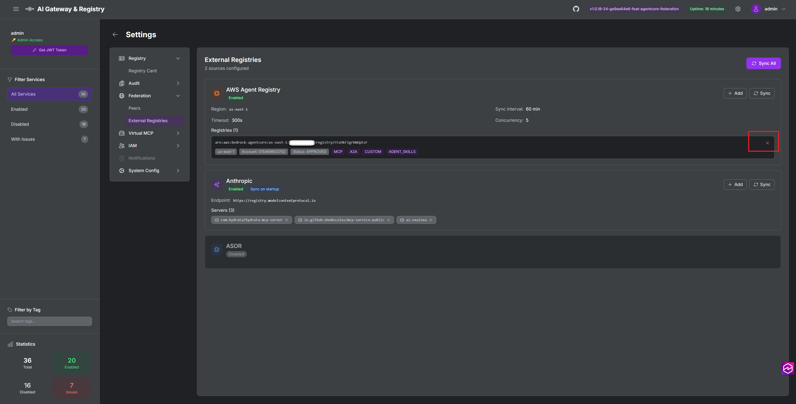
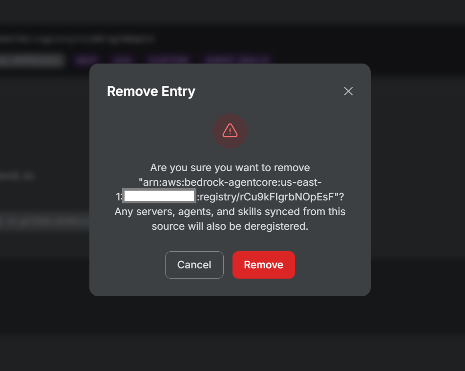

# AWS Agent Registry Federation

This guide covers how to federate MCP servers, A2A agents, and agent skills from [Amazon Bedrock AgentCore](https://docs.aws.amazon.com/bedrock-agentcore/latest/devguide/registry.html) registries into the MCP Gateway Registry. Once federated, AgentCore records appear alongside locally registered assets and can be discovered, searched, and invoked through the gateway.

[Demo Video](https://app.vidcast.io/share/6d2e0a43-4a68-477e-b5b9-2b3e2aa59f83?playerMode=vidcast)

## Overview

AWS Agent Registry Federation connects MCP Gateway Registry to one or more Amazon Bedrock AgentCore registries. The gateway periodically syncs records from each configured registry, transforming AgentCore descriptors (MCP, A2A, CUSTOM, AGENT_SKILLS) into native MCP Gateway assets. Cross-account and cross-region access is supported via IAM role assumption.

### What Gets Synced

| AgentCore Descriptor Type | MCP Gateway Asset Type | Stored In |
|---------------------------|----------------------|-----------|
| MCP | MCP Server | `mcp_servers` collection |
| A2A | A2A Agent | `mcp_agents` collection |
| CUSTOM | A2A Agent | `mcp_agents` collection |
| AGENT_SKILLS | Agent Skill | `agent_skills` collection |

### Key Capabilities

- **Multi-registry**: Add multiple AgentCore registries (same or different AWS accounts/regions)
- **Cross-account**: Assume an IAM role in another account to read its registry
- **Selective sync**: Choose which descriptor types to sync per registry
- **Status filtering**: Sync only APPROVED, PENDING, or REJECTED records
- **Cascade cleanup**: Removing a registry automatically deregisters all its synced assets
- **Startup sync**: Optionally sync records when the gateway starts

## Prerequisites

- MCP Gateway Registry up and running (Docker Compose or ECS)
- AWS credentials with Amazon Bedrock AgentCore permissions (see [IAM Setup](#iam-setup))
- At least one AgentCore registry with published records

## Step 1: Enable AWS Agent Registry Federation

### Option A: Environment Variable (Recommended for ECS/Terraform)

Set the environment variable in your `.env` file or ECS task definition:

```bash
AWS_REGISTRY_FEDERATION_ENABLED=true
```

This overrides the `aws_registry.enabled` flag in the federation config on every startup. For Terraform deployments, set in `terraform.tfvars`:

```hcl
aws_registry_federation_enabled = true
```

### Option B: API

Enable via the federation config API:

```bash
curl -X PUT https://your-registry.com/api/federation/config/default \
  -H "Content-Type: application/json" \
  -H "Authorization: Bearer <token>" \
  -d '{
    "aws_registry": {
      "enabled": true,
      "aws_region": "us-east-1",
      "sync_on_startup": true
    }
  }'
```

### Option C: Settings UI

Navigate to **Settings > Federation > External Registries**. The AWS Agent Registry card will show "Enabled" or "Disabled" based on the current configuration.



## Step 2: Add a Registry

### Using the UI

1. Navigate to **Settings > Federation > External Registries**
2. On the **AWS Agent Registry** card, click the **+** (Add) button

3. In the Add AWS Agent Registry modal, enter the **Registry ID** (ARN or plain ID)
   - If you paste a full ARN (`arn:aws:bedrock-agentcore:us-east-1:123456789012:registry/rXXXXXXXX`), the **AWS Region** and **AWS Account ID** fields auto-populate from the ARN

4. (Optional) Fill in additional fields:
   - **AWS Account ID**: Auto-populated from ARN, or enter manually
   - **AWS Region**: Auto-populated from ARN, or enter manually (leave empty to use global region)
   - **Assume Role ARN**: Only needed if adding a registry from a different AWS account
   - **Descriptor Types**: Select which types to sync (MCP, A2A, CUSTOM, AGENT_SKILLS)
   - **Sync Status Filter**: Choose APPROVED (default), PENDING, or REJECTED

5. Click **Add**



### Using the API

```bash
curl -X POST https://your-registry.com/api/federation/config/default/aws_registry/registries \
  -H "Content-Type: application/json" \
  -H "Authorization: Bearer <token>" \
  -d '{
    "registry_id": "arn:aws:bedrock-agentcore:us-east-1:123456789012:registry/rCu9kFIgrbNOpEsF",
    "aws_account_id": "123456789012",
    "aws_region": "us-east-1",
    "descriptor_types": ["MCP", "A2A", "CUSTOM", "AGENT_SKILLS"],
    "sync_status_filter": "APPROVED"
  }'
```

### Using the CLI

```bash
# Save a federation config with AWS Agent Registry enabled
uv run python registry_management.py federation-save \
  --config cli/examples/federation-config-agentcore-example.json

# Or get existing config, edit, and save back
uv run python registry_management.py federation-get --json > federation-config.json
# Edit federation-config.json to add registry entries under aws_registry.registries
uv run python registry_management.py federation-save --config federation-config.json
```

## Step 3: Sync Records

### Manual Sync (UI)

After adding, the registry entry appears on the card showing the ARN, account ID, status filter, and descriptor type tags.



Click the **Sync** button on the AWS Agent Registry card to trigger an immediate sync of all configured registries.

### Manual Sync (API)

```bash
# Sync only AWS Agent Registry source
curl -X POST https://your-registry.com/api/federation/sync?source=aws_registry \
  -H "Authorization: Bearer <token>"

# Sync all federation sources
curl -X POST https://your-registry.com/api/federation/sync \
  -H "Authorization: Bearer <token>"
```

### Manual Sync (CLI)

```bash
# Sync only AWS Agent Registry source
uv run python registry_management.py federation-sync --source aws_registry

# Sync all federation sources
uv run python registry_management.py federation-sync
```

### Automatic Sync on Startup

Set `sync_on_startup: true` in the federation config (via API or UI) to sync automatically when the gateway starts.

## Step 4: Verify Synced Assets

After syncing, the card shows the sync result with a breakdown of synced items and a toast notification confirming the count.



Federated assets appear in the main registry views under the **External Registries** tab:

- **MCP Servers**: Synced servers appear with `source: agentcore` and an `agentcore` tag
- **A2A Agents**: Synced agents appear with `agentcore` tag and metadata containing the source registry ID
- **Agent Skills**: Synced skills appear with `agentcore` tag and serve inline content



## Removing a Registry

### Using the UI

1. On the AWS Agent Registry card, click the **X** (remove) button next to the registry entry



2. Confirm the deletion in the modal dialog. The modal warns that all servers, agents, and skills synced from this source will also be deregistered.




### Using the API

```bash
# URL-encode the registry ID (ARNs contain colons and slashes)
curl -X DELETE "https://your-registry.com/api/federation/config/default/aws_registry/registries/arn%3Aaws%3Abedrock-agentcore%3Aus-east-1%3A123456789012%3Aregistry%2FrCu9kFIgrbNOpEsF" \
  -H "Authorization: Bearer <token>"
```

### Cascade Cleanup

When a registry is removed, all assets that were synced from it are automatically deregistered:
- MCP servers with `source: agentcore` and matching `metadata.agentcore_registry_id`
- A2A agents with matching `metadata.agentcore_registry_id` or `agentcore` tag + path prefix
- Agent skills with matching metadata or `agentcore` tag + path prefix

The API response includes counts of deregistered assets:

```json
{
  "message": "Registry removed and 3 server(s), 2 agent(s), 1 skill(s) deregistered",
  "deregistered": {
    "servers": ["/agentcore-my-server"],
    "agents": ["/agents/agentcore-my-agent-1", "/agents/agentcore-my-agent-2"],
    "skills": ["/skills/agentcore-my-skill"]
  }
}
```

## Cross-Account Federation

To sync from a registry in a different AWS account:

1. In the remote account, create an IAM role with AgentCore read permissions and a trust policy allowing your gateway's task role to assume it
2. Tag the role with `Purpose: agentcore-federation` (required by the STS condition policy)
3. When adding the registry, provide the **Assume Role ARN** field

```bash
curl -X POST https://your-registry.com/api/federation/config/default/aws_registry/registries \
  -H "Content-Type: application/json" \
  -H "Authorization: Bearer <token>" \
  -d '{
    "registry_id": "arn:aws:bedrock-agentcore:us-west-2:999888777666:registry/rRemoteReg",
    "aws_account_id": "999888777666",
    "aws_region": "us-west-2",
    "assume_role_arn": "arn:aws:iam::999888777666:role/AgentCoreFederationReadOnly"
  }'
```

## IAM Setup

### ECS Deployment (Terraform)

When `aws_registry_federation_enabled = true` in `terraform.tfvars`, Terraform automatically creates and attaches a `bedrock_agentcore_access` IAM policy to the registry ECS task role with:

- `bedrock-agentcore:*` -- Full access to AgentCore APIs
- `sts:AssumeRole` -- For cross-account federation (scoped to roles tagged `Purpose: agentcore-federation`)

### Docker Compose / Local

For local deployments, ensure the AWS credentials available to the container have the following permissions:

```json
{
  "Version": "2012-10-17",
  "Statement": [
    {
      "Effect": "Allow",
      "Action": [
        "bedrock-agentcore:ListRegistries",
        "bedrock-agentcore:ListRegistryRecords",
        "bedrock-agentcore:GetRegistryRecord"
      ],
      "Resource": "*"
    }
  ]
}
```

## Configuration Reference

### Environment Variables

| Variable | Description | Default |
|----------|-------------|---------|
| `AWS_REGISTRY_FEDERATION_ENABLED` | Override `aws_registry.enabled` in federation config | (not set) |

### Federation Config Fields (`aws_registry` section)

| Field | Type | Description | Default |
|-------|------|-------------|---------|
| `enabled` | bool | Enable/disable AWS Agent Registry federation | `false` |
| `aws_region` | string | Default AWS region for AgentCore API calls | `us-east-1` |
| `sync_on_startup` | bool | Sync records when the gateway starts | `false` |
| `sync_interval_minutes` | int | Interval between automatic syncs | `60` |
| `sync_timeout_seconds` | int | Timeout for sync operations | `300` |
| `max_concurrent_fetches` | int | Max parallel registry fetches | `5` |
| `registries` | list | List of registry configurations (see below) | `[]` |

### Per-Registry Config Fields

| Field | Type | Required | Description |
|-------|------|----------|-------------|
| `registry_id` | string | Yes | Registry ID or full ARN |
| `aws_account_id` | string | No | AWS account ID (auto-extracted from ARN) |
| `aws_region` | string | No | Override region for this registry |
| `assume_role_arn` | string | No | IAM role ARN for cross-account access |
| `descriptor_types` | list[string] | No | Types to sync: MCP, A2A, CUSTOM, AGENT_SKILLS |
| `sync_status_filter` | string | No | Record status to sync: APPROVED, PENDING, REJECTED |

## Troubleshooting

### AWS Agent Registry shows "Disabled"

- Verify `AWS_REGISTRY_FEDERATION_ENABLED=true` is set in the environment
- Check the registry container logs for `AWS_REGISTRY_FEDERATION_ENABLED=true (from env var)`
- If using ECS, verify the env var is present in the task definition

### Sync returns no records

- Verify IAM permissions (see [IAM Setup](#iam-setup))
- Check that the registry has records with the configured `sync_status_filter` (default: APPROVED)
- Check container logs for API errors: `Failed to sync AgentCore server`

### Cross-account sync fails

- Verify the remote IAM role trust policy allows your task role to assume it
- Verify the role is tagged with `Purpose: agentcore-federation`
- Check that `assume_role_arn` is set correctly on the registry entry

### Assets not cleaned up after registry removal

- Older records synced before metadata tracking may only have tag-based matching
- Check container logs for `Deregistered X server(s), Y agent(s), Z skill(s)`
- Manually remove orphaned assets if needed via the MCP Servers or Agents UI
