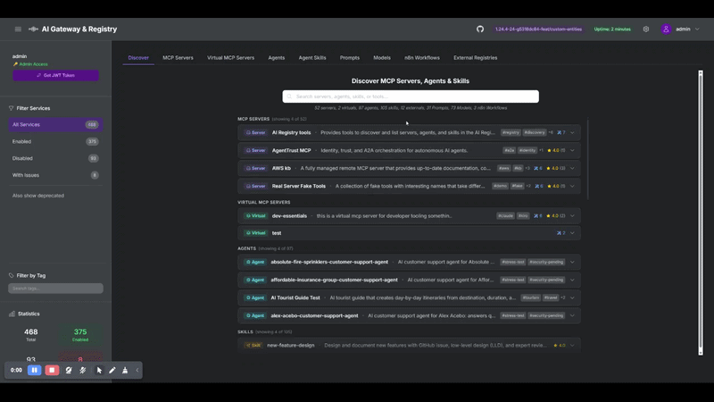

# Custom Entity Types

> **Demo video (60s):** [Custom Entity Types walkthrough](https://github.com/user-attachments/assets/3858e990-e26e-4d49-b408-1e64ca42e2fd)



Custom entity types let a registry admin define **new catalog types at runtime**,
each with its own schema, and then store records of that type. Records get their
own dynamically-rendered tab, lexical and semantic search, a star rating, and
appear in the unified "search everything" results alongside MCP servers, agents,
and skills.

Use them to catalog anything the built-in types (servers, agents, skills) don't
cover, for example: LLM prompts, model cards, n8n workflows, runbooks, datasets,
or evaluation suites.

> **Feature flag:** Custom entity types are **off by default**. Enable with
> `CUSTOM_ENTITY_TYPES_ENABLED=true`. When off, the routers are not registered,
> the tabs are hidden, and existing records are excluded from search (the data
> stays in the datastore but is unreachable until the flag is re-enabled). See
> [Configuration](#configuration).

## Core concept: types first, then records

There are two distinct objects, and the order matters:

1. **Custom TYPE (the schema).** An admin defines a type once, programmatically,
   via `POST /api/custom-types`. A type has a URL-safe `name` (immutable), an
   optional `display_name` for the tab, and a list of typed `fields`. **There is
   no UI for creating a type** — it is an admin, API-only operation.
2. **Records (instances of the type).** Once the type exists, records can be
   created either **programmatically** (`POST /api/custom/{type}`) **or through
   the UI** (the dynamically-rendered tab has a Create form). Any authenticated
   user can create records (subject to visibility rules); the type itself is
   admin-only.

```
Admin defines TYPE (API only)  ->  Users create RECORDS (API or UI)
        /api/custom-types                /api/custom/{type}  or  the UI tab
```

This split is deliberate: defining a schema is a privileged, low-frequency
operation, while creating records of an existing schema is everyday usage.

## Field schema

Each field in a type descriptor has:

| Property | Required | Meaning |
|----------|----------|---------|
| `name` | yes | Attribute key stored inside the record's `attributes` bag (alphanumeric/underscore, max 64). Must not collide with reserved envelope keys. |
| `datatype` | yes | One of the datatypes below. |
| `label` | no | Display label; falls back to a humanized `name`. |
| `enum_values` | enum only | Allowed values; **required** when `datatype` is `enum`, rejected otherwise. |
| `required` | no | If true, the record must supply this attribute. Defaults to false. |
| `semantic` | no | If true, the field's value is included in the search embedding text. |
| `show_in_list` | no | If true, the field is rendered on the list/card view. |

**Datatypes:** `string` (single-line), `text` (multi-line), `number` (int or
float), `bool` (checkbox), `enum` (select; needs `enum_values`), `date`
(ISO-8601 `YYYY-MM-DD`), `array<string>` (tag/chip input).

## Step 1: Define a type (admin, API only)

The descriptor is admin-authored. Post it to `/api/custom-types`. Example, an
`llm_prompt` type:

```bash
export TOK=$(jq -r '.tokens.access_token // .access_token' .token)

curl -sS -X POST http://localhost/api/custom-types \
  -H "Authorization: Bearer $TOK" -H "Content-Type: application/json" \
  -d '{
    "name": "llm_prompt",
    "display_name": "Prompts",
    "description": "Reusable, versioned LLM prompts shared across teams.",
    "fields": [
      { "name": "prompt_text", "label": "Prompt Text", "datatype": "text",
        "required": true, "semantic": true },
      { "name": "role", "label": "Role", "datatype": "enum",
        "enum_values": ["system", "user", "assistant", "developer"],
        "required": true, "show_in_list": true },
      { "name": "use_case", "label": "Use Case", "datatype": "string",
        "semantic": true, "show_in_list": true },
      { "name": "temperature", "label": "Suggested Temperature", "datatype": "number" },
      { "name": "tested", "label": "Production Tested", "datatype": "bool",
        "show_in_list": true }
    ]
  }'
```

Or with the management CLI:

```bash
uv run python api/registry_management.py --registry-url http://localhost --token-file .token \
  custom-type-create --config cli/examples/custom_type_llm_prompt.json
```

Ready-to-use example descriptors live in
[`cli/examples/`](../cli/examples/): `custom_type_llm_prompt.json`,
`custom_type_model_card.json`, `custom_type_n8n_workflow.json` (plus a matching
`custom_record_*.json` for each).

Notes:

- `name` is URL-safe (`^[a-z0-9_-]+$`, max 64), **IMMUTABLE**, and becomes both
  the record path prefix (`/{name}/{uuid}`) and the `entity_type` discriminator.
- Type creation is **admin-only** (`mcp-registry-admin` group/scope or `is_admin`).
- Reserved type names (`mcp_server`, `a2a_agent`, `skill`, `virtual_server`,
  `tool`) are rejected.

### Editing a type

The type `name` and the field schema are **immutable** (changing them would
orphan existing records and embeddings). Only the human-facing metadata can be
edited, via `PATCH /api/custom-types/{name}`:

```bash
curl -sS -X PATCH http://localhost/api/custom-types/llm_prompt \
  -H "Authorization: Bearer $TOK" -H "Content-Type: application/json" \
  -d '{"display_name": "Prompts", "description": "Updated description."}'
```

To change a type's `name` or fields, delete and recreate it (a destructive
operation that cascades away its records).

## Step 2: Create records (API or UI)

### Programmatically

```bash
curl -sS -X POST http://localhost/api/custom/llm_prompt \
  -H "Authorization: Bearer $TOK" -H "Content-Type: application/json" \
  -d '{
    "name": "Concise Code Reviewer",
    "description": "System prompt for terse, high-signal code review.",
    "visibility": "public",
    "tags": ["code-review", "engineering"],
    "attributes": {
      "prompt_text": "You are a senior engineer reviewing a PR...",
      "role": "system",
      "use_case": "Automated PR review in CI",
      "temperature": 0.2,
      "tested": true
    }
  }'
```

Or via the CLI:

```bash
uv run python api/registry_management.py --registry-url http://localhost --token-file .token \
  custom-record-create --type llm_prompt --config cli/examples/custom_record_llm_prompt.json
```

The record envelope is uniform across all types: `name`, `description`,
`visibility` (`public` / `private` / `group-restricted`), `allowed_groups`,
`tags`, plus the per-type `attributes` validated against the descriptor. The
`owner` is always derived from the caller, never the request body.

### Through the UI

Once the type exists and the feature is enabled, its tab appears in the
dashboard (rendered dynamically from the descriptor). The tab provides a
**Create** button that opens a schema-driven form with the right widget per
datatype (text input, textarea, number, checkbox, enum select, date picker, tag
chips). Records can be created, edited, viewed (with a **Copy JSON** button that
copies the full stored record), rated, and deleted from the UI. The listing is
paginated client-side.

## Searching custom records

Custom records participate in the unified semantic search automatically when the
feature is enabled. A default-scope query returns them alongside the other entity
types:

```bash
curl -sS -X POST http://localhost/api/search/semantic \
  -H "Authorization: Bearer $TOK" -H "Content-Type: application/json" \
  -d '{"query": "summarize my meeting into action items", "limit": 5}' | jq '.custom'
```

To scope to specific custom types, pass their names in `entity_types`:

```bash
  -d '{"query": "...", "entity_types": ["llm_prompt", "model_card"], "limit": 5}'
```

Fields marked `semantic: true` in the descriptor feed the embedding text, so
choose those fields to make records findable by their substance.

## API surface

| Action | Method + Path | Auth |
|--------|---------------|------|
| List types | `GET /api/custom-types` | any authenticated |
| Get type | `GET /api/custom-types/{name}` | any authenticated |
| Create type | `POST /api/custom-types` | admin |
| Update type metadata | `PATCH /api/custom-types/{name}` | admin |
| Delete type (cascading) | `DELETE /api/custom-types/{name}?force=true` | admin |
| List records | `GET /api/custom/{type}?skip=0&limit=100` | any authenticated (visibility-filtered) |
| Create record | `POST /api/custom/{type}` | any authenticated |
| Update record | `PUT /api/custom/{type}/{uuid}` | owner or admin |
| Delete record | `DELETE /api/custom/{type}/{uuid}` | owner or admin |
| Rate record | `POST /api/custom/{type}/{uuid}/rate` | any with view access |
| Get rating | `GET /api/custom/{type}/{uuid}/rating` | any with view access |

The list endpoint is paginated: pass `skip` and `limit` (max 1000); the response
includes `records`, `total_count`, `skip`, and `limit`.

## Configuration

| Parameter | Default | Purpose |
|-----------|---------|---------|
| `CUSTOM_ENTITY_TYPES_ENABLED` | `false` | Master switch. Off = feature invisible (routers unregistered, tabs hidden, records excluded from search). |
| `CUSTOM_TYPE_CACHE_TTL_SECONDS` | `60` | TTL for the in-process descriptor cache used by read paths. |
| `MAX_CUSTOM_RECORDS_PER_TYPE` | `1000` | Soft (best-effort) cap on records per type; `0` = unlimited. |
| `MAX_CUSTOM_TYPES` | `50` | Cap on the number of types an admin can define; `0` = unlimited. |

These are wired across all three deployment surfaces (Docker `.env`,
Terraform `.tfvars`, Helm `values.yaml`); see
[`docs/unified-parameter-reference.md`](unified-parameter-reference.md).

## Resource governance

Each type carries its own embedding collection, and each record write triggers
an embedding computation. To keep a multi-tenant registry bounded, both a
type cap (`MAX_CUSTOM_TYPES`, default 50) and a per-type record cap
(`MAX_CUSTOM_RECORDS_PER_TYPE`, default 1000) are enforced; hitting either
returns HTTP 409. Descriptor text fields (labels, display names, descriptions,
enum options) are length-bounded so a single descriptor cannot bloat the cached
snapshot held by every replica. Both caps are best-effort under heavy
concurrency (count-then-create), which is acceptable for admin-gated,
low-frequency type creation and bulk record imports.
