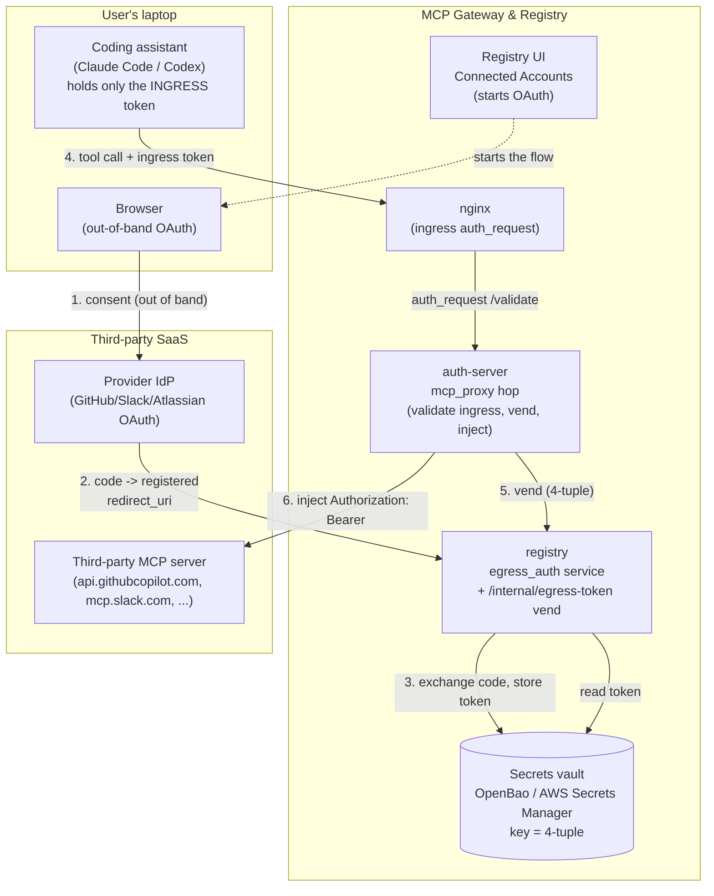
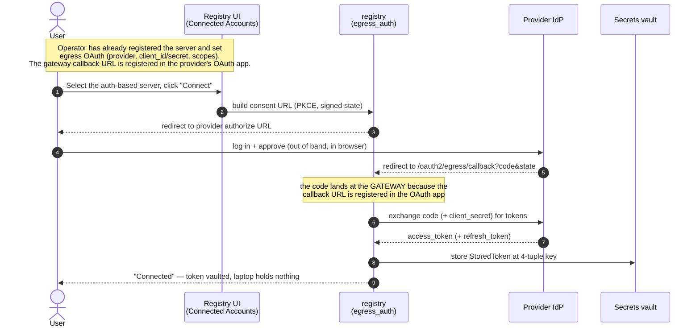
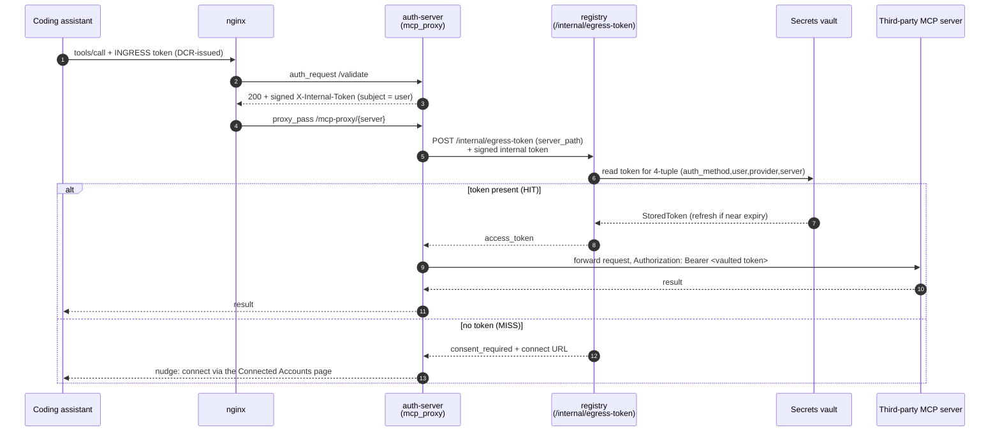

# Egress Authentication Design (Per-User Credentials to Third-Party MCP Servers)

How the MCP Gateway lets a user reach an authentication-protected ("auth-based")
third-party MCP server — GitHub, Slack, Atlassian, etc. — **as themselves**,
without the coding assistant ever handling the third-party token.

- Status of the three modes: **`vault-oauth` (3LO) is implemented today**;
  **`token-exchange` (OBO)** and **`vault-pat` (PAT)** are designed but not yet
  built (placeholders below).
- Authoritative implementation references: `registry/egress_auth/`,
  `registry/secrets/`, `registry/api/egress_auth_routes.py`,
  `auth_server/server.py` (`mcp_proxy`, `_vend_egress_token`).

---

## The core idea (in one paragraph)

The user's OAuth to the third party happens **out of band** from the
coding-assistant ↔ gateway interaction. The gateway UI provides an easy way to
start the OAuth flow with the third-party ("auth-based") MCP server. The thing
that **links the gateway to the third-party MCP server is the redirect URL** you
configure when creating the OAuth app on the third-party side
(`https://<gateway>/oauth2/egress/callback`). When the user completes the OAuth
flow, the third party sends the authorization code to the gateway **because that
callback URL is registered in the OAuth app** — the gateway exchanges it for a
token and stores that token in a secrets vault, keyed by a **4-tuple**
`(auth_method, user_id, provider, server_path)`. Later, when the user (through
their coding assistant) calls that MCP server, the assistant only presents its
**ingress token** (obtained via DCR today; CIMD in the future). The gateway
validates the ingress token, looks up the vault for a token matching this user +
this server (the 4-tuple), and if present **injects it as the `Authorization`
header** on the outbound request to the third-party MCP server. Everything just
works, and **the third-party token is never stored on the user's laptop.**

---

## Block diagram



Key properties visible in the diagram:

- The **redirect URL** (`/oauth2/egress/callback`) is the only link between the
  gateway and the provider IdP — it is what causes the code (and thus the token)
  to land at the gateway rather than the laptop.
- The **coding assistant only ever holds the ingress token** (its credential to
  the gateway). It never sees the third-party token.
- The **vault is the single source of truth** for third-party tokens, addressed
  by the 4-tuple.

---

## The vault key: a 4-tuple

Every stored third-party token is addressed by
`(auth_method, user_id, provider, server_path)`
(`registry/egress_auth/schemas.py`, `registry/secrets/openbao/store.py`). In the
OpenBao KV v2 backend the path is (each segment base64url-encoded so it is
path-safe):

```
{mount}/data/{prefix}/{enc(auth_method)}/{enc(user_id)}/{enc(provider)}/{enc(server_path)}
```

| Segment | Meaning | Example |
|---------|---------|---------|
| `auth_method` | The canonical ingress auth method the user logged in with | `oauth2` |
| `user_id` | The verified user identity (from the signed ingress claims) | `admin` |
| `provider` | The egress OAuth provider | `github` / `slack` / `atlassian` / `custom` |
| `server_path` | The registered MCP server path | `/slack` |

The stored payload (`StoredToken`) holds `access_token`, optional
`refresh_token`, `expires_at`, `status`, and timestamps — the vault read returns
everything needed to decide vend-vs-refresh. **There is no companion app-DB row;
the vault is the only place token state lives.**

Because the key includes `user_id`, one user can never vend another user's
token — the identity comes from the **verified** signed internal-hop claims, not
a forgeable header.

---

## Setup sequence (one-time, per user, out of band)



The consent `state` is AEAD-encrypted and session-bound (anti-phishing): the
callback verifies the opener is the same user who started the flow, so a stolen
consent URL opened by someone else cannot bind a token to the wrong account.

---

## Runtime sequence (every tool call)



What each hop guarantees:

- **`/validate`** binds the verified `subject` (user identity) into a signed
  `X-Internal-Token`. `mcp_proxy` reads identity from these verified claims, not
  from forgeable inbound headers (internal-hop hardening, #1260/#1262).
- **`/internal/egress-token`** (registry) is guarded by internal auth, re-checks
  the server is `egress_auth_mode == oauth_user`, and returns the access token
  only (never the refresh token). Lazy refresh + cross-replica single-flight
  happen here.
- **Injection** happens last in `mcp_proxy`: the user's own gateway
  credentials/identity headers are stripped and replaced with
  `Authorization: Bearer <vaulted third-party token>`. The token never transits
  the coding assistant.

---

## Why this is simple and safe

- **Out-of-band OAuth.** The consent dance is entirely separate from the
  assistant ↔ gateway traffic; the assistant is never part of the third-party
  OAuth. It only does its own ingress auth (DCR today, CIMD in future).
- **The redirect URL is the link.** Registering
  `https://<gateway>/oauth2/egress/callback` in the provider's OAuth app is what
  routes the token to the gateway instead of the laptop. No token ever lands on
  the user's machine.
- **The 4-tuple keeps it per-user and per-server.** A vault lookup that includes
  the verified user identity means users can only ever use their own tokens, and
  only for the servers they connected.
- **The vault is the single source of truth.** Tokens live only in OpenBao / AWS
  Secrets Manager; there is no copy in the app DB and none on the client.

### Why this matters for enterprise security & governance

The gateway **owns the authentication to every third-party MCP server**, which
turns a sprawl of per-laptop credentials and outbound connections into a single,
governable choke point:

- **No third-party tokens on user machines.** The token exists only in the
  vault and is injected server-side. A lost/compromised laptop leaks no
  third-party credentials; offboarding a user is a vault delete, not a hunt
  across devices.
- **Clients need connectivity only to the gateway, not to each MCP server.**
  All egress to GitHub/Slack/Atlassian/etc. originates from the gateway. In an
  enterprise you can put the gateway in a controlled network zone with the only
  sanctioned outbound path, instead of allowing every developer machine to reach
  every SaaS endpoint directly.
- **One place to enforce and observe.** Access control (which user may reach
  which server), credential rotation/revocation, per-call audit logging, and
  network egress policy are all applied at the gateway — centrally — rather than
  replicated and hoped-for on each client.

---

## The three egress modes

`egress_auth_mode` on the server entry selects how the gateway obtains the
outbound credential. Today only the vault-OAuth (3LO) path is implemented; the
other two are designed and reserved.

| Mode | Vault used? | How the egress credential is obtained | Status |
|------|-------------|----------------------------------------|--------|
| **`vault-oauth` (3LO)** | Yes | User completes provider OAuth (3LO) out of band; the gateway vaults the per-user token and injects it. This document's main flow. | **Implemented** (`egress_auth_mode = "oauth_user"`) |
| **`token-exchange` (OBO)** | No | For same-trust-domain backends, the gateway exchanges the user's ingress token for a backend-audience token (RFC 8693 / Entra jwt-bearer). `sub` preserved; nothing stored. | **Placeholder — not implemented** |
| **`vault-pat` (PAT)** | Yes | A per-user static Personal Access Token / API key is stored in the vault and injected. No OAuth dance. | **Placeholder — not implemented** |

### `vault-oauth` (3LO) — implemented

The flow described throughout this document. `egress_auth_mode = "oauth_user"`
on the server, `egress_oauth` holds the provider config (client_id, encrypted
client_secret, scopes). See
[Per-User Egress Credential Vault](../egress-credential-vault.md) and the FAQ
[Registering third-party MCP servers](../faq/registering-third-party-mcp-servers.md).

### `token-exchange` (OBO) — placeholder

> Not yet implemented. Design intent: when the gateway IdP and the backend share
> a trust domain (e.g. M365 in the same Entra tenant), exchange the user's
> verified ingress token for a token scoped to the backend's audience and inject
> that. `sub` is carried cryptographically across the exchange; **no vault, no
> refresh loop, nothing stored per user.** Fails closed (never relays the ingress
> token, never falls back to app-only credentials). Its reach is limited to
> same-trust-domain backends — public SaaS (GitHub/Slack) does not federate with
> the gateway IdP, so those use `vault-oauth` instead.

### `vault-pat` (PAT) — placeholder

> Not yet implemented. Design intent: for backends that only accept a static
> Personal Access Token / API key, store a per-user PAT in the same vault
> (keyed by the same 4-tuple) and inject it on egress, skipping the OAuth dance.
> Admin seed-on-behalf is planned (an admin may seed a PAT for another user,
> audit-logged). Same "token never on the laptop" property as 3LO.

---

## References

- [Per-User Egress Credential Vault](../egress-credential-vault.md) — operational guide
- [Registering third-party MCP servers (FAQ)](../faq/registering-third-party-mcp-servers.md)
- [Internal-hop authentication](internal-hop-authentication.md) — the signed `X-Internal-Token` this relies on
- Code: `registry/egress_auth/`, `registry/secrets/`, `registry/api/egress_auth_routes.py`, `auth_server/server.py`
