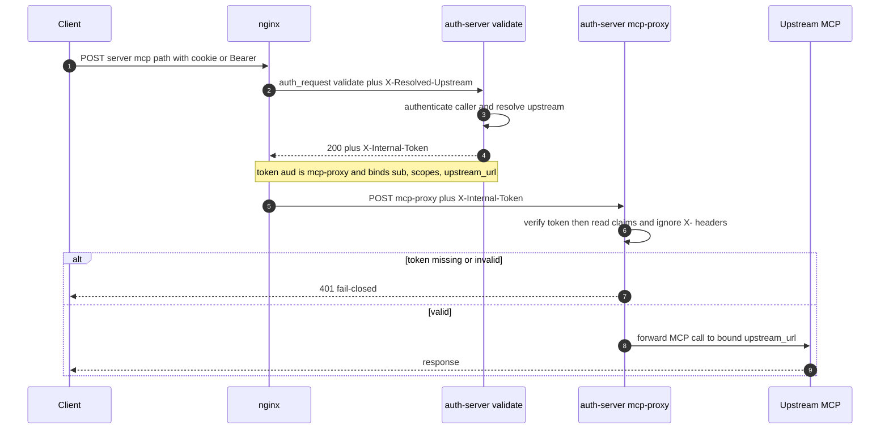
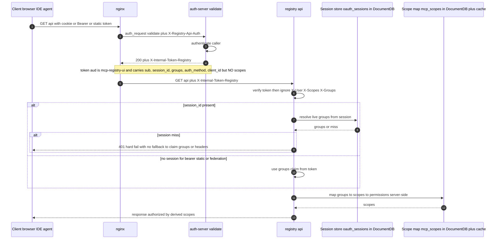

# Internal Hop Authentication (Signed Inter-Component Tokens)

*How the components inside the gateway prove identity to each other.*

## Related documentation

- [Authentication and Authorization Design](authentication-design.md) - how the *external* caller is authenticated
- [Session flow (cookie-based)](session-flow-cookie-based.md) and [Session flow (JWT bearer)](session-flow-jwt-bearer.md)
- [Reverse-proxy vs application-layer gateway](architectural-decision-reverse-proxy-vs-application-layer-gateway.md)

---

## 100 level: What this is

The gateway is several processes talking to each other: an **nginx** front door, an
**auth-server** that decides who you are, a **registry** that serves the `/api/` control plane
and the UI, and the **upstream MCP servers** that hold the actual tools.

When a request comes in, nginx asks the auth-server "is this caller allowed?" (the `auth_request`
pattern). Once that succeeds, nginx forwards the request on to the registry or to the MCP-proxy,
and the downstream component needs to know who the caller is.

It learns the caller's identity from a **short-lived, signed token** that the auth-server's
`/validate` mints - `/validate` is the only component that has actually authenticated the caller.
The downstream component **verifies the signature** and trusts only the claims inside the token; it
ignores any plaintext identity headers on the request. A missing or invalid token is rejected
(fail-closed).

This matters because the internal ports are only meant to be reached *through* nginx. If something
else can reach them directly (a misconfigured network, an SSRF, a co-located pod), plaintext headers
like `X-User: admin` would be trivial to forge. Requiring a signed token means a caller who does not
hold the signing key cannot impersonate anyone, regardless of which headers it sends.

In one sentence: **internal hops authenticate each other with cryptographically signed identity
tokens, not plaintext headers.**

---

## 200 level: The components and the hops

### Components

| Component | Role |
|-----------|------|
| Client | Browser UI, IDE, agent, or curl - the external caller |
| nginx | Reverse proxy / front door; runs `auth_request /validate` before proxying |
| auth-server | Authenticates the caller at `/validate`; also hosts the `/mcp-proxy` hop. The only place that mints internal tokens. |
| registry | Serves `/api/*` (UI backend / control plane) and generates the nginx config |
| upstream MCP server | The actual tool server behind the gateway |
| IdP | External identity provider (Keycloak, Entra, Okta, Auth0, Cognito) |

### The request path

```
Client --> nginx --> (auth_request) auth-server /validate --> back to nginx
                                                                  |
                       +------------------------------------------+
                       |                                          |
                 registry /api/*                          auth-server /mcp-proxy --> upstream MCP
```

`/validate` is the single point that holds the verified identity, so it is the component that
**mints** the per-hop tokens. The downstream hops **verify** them.

### How each hop authenticates

| Hop (who -> who) | Protects | Mechanism |
|------------------|----------|-----------|
| Client -> nginx | entry | TLS + cookie/Bearer |
| nginx -> auth-server `/validate` | establish identity | the `auth_request` subrequest where identity is *established* |
| nginx -> auth-server `/mcp-proxy` | MCP traffic | verifies signed `X-Internal-Token` (ignores `X-User` / `X-Scopes` / `X-Upstream-Url`) |
| nginx -> registry `/api/*` | registry control plane | verifies signed `X-Internal-Token-Registry` (ignores `X-User` / `X-Scopes` / `X-Groups`) |
| gateway -> upstream MCP | forward tool call | per-server auth (none/bearer/api_key) |
| auth-server <-> IdP | verify the human/M2M | OAuth2/OIDC |

### The two signed-token hops

| | `/mcp-proxy` hop | registry `/api/` hop |
|---|---|---|
| Token header | `X-Internal-Token` | `X-Internal-Token-Registry` |
| Audience (`aud`) | `mcp-proxy` | `mcp-registry-ui` |
| Carries | identity + scopes + **bound upstream URL** | identity only (**no scopes**) |
| Authorization | scopes are in the token | registry derives scopes from groups **server-side** |
| Signing | HS256 with the shared `SECRET_KEY` | HS256 with the shared `SECRET_KEY` |
| On failure | fail-closed 401 | fail-closed 401 |
| nginx mechanism | `auth_request_set` captures the minted token and forwards it | same |

A third audience, `mcp-registry`, is used for service-to-service tokens in
`registry/auth/internal.py`. The three audiences are deliberately distinct so a token minted for one
internal context cannot be replayed in another (PyJWT `verify_aud` rejects mismatches).

### Worked examples: which hop fires for which end-user action

nginx routes **every MCP protocol POST to a server path** (`/<server>/mcp`) through `/mcp-proxy` -
that includes `initialize`, `tools/list`, `resources/list`, and `tools/call`, not just tool calls.
Anything under `/api/` goes to the registry hop instead. The table below maps real end-user actions
to the hop they exercise.

| End-user action | Request nginx sees | Hop / token used |
| --- | --- | --- |
| Open the UI, list servers/agents/skills | `GET /api/servers`, `/api/agents`, ... | **registry `/api/` hop** (`X-Internal-Token-Registry`) |
| Rate a server, manage groups, view config | `GET`/`POST`/`PATCH /api/...` | **registry `/api/` hop** |
| Click "Get JWT Token" / load own profile | `GET /api/auth/me` | **registry `/api/` hop** (this one location also marks `X-Registry-Api-Auth`) |
| Log in (OAuth2) | `/oauth2/login/...`, `/api/auth/...` | neither internal token - public auth endpoints, no `auth_request` identity hop |
| Health/version probes | `GET /api/health`, `/api/version` | registry, but **no** `X-Registry-Api-Auth` (public, no token minted) |
| IDE/agent connects to an MCP server (handshake) | `POST /<server>/mcp` method `initialize` | **`/mcp-proxy` hop** (`X-Internal-Token`) |
| IDE/agent lists tools | `POST /<server>/mcp` method `tools/list` | **`/mcp-proxy` hop** |
| **Agent invokes a tool** | `POST /<server>/mcp` method `tools/call` | **`/mcp-proxy` hop** |
| Tool-call response streamed back (SSE) | `GET /<server>/sse` | **`/mcp-proxy` hop** |

A typical session touches **both** hops: the browser UI rides the registry `/api/` hop the whole
time, and the moment that user (or their IDE/agent) talks MCP to a server - starting at `initialize`,
not at the first `tools/call` - every one of those POSTs rides the `/mcp-proxy` hop. In short:
**`/api/` is the registry control plane (UI and management); `/mcp-proxy` is all MCP protocol traffic
to a server, of which `tools/call` is just one method.**

---

## 300 level: Mechanics, sequence diagrams, and design decisions

### Minting and verification

- The token is a short-lived **HS256 JWT** signed with the shared `SECRET_KEY` (the same key the
  registry and auth-server share for other internal signing; not a dedicated secret for this hop).
- TTL and clock-skew leeway come from `INTERNAL_TOKEN_TTL_SECONDS` (default 30, floor 5) and
  `INTERNAL_TOKEN_LEEWAY_SECONDS` (default 5). Both the minter (auth-server) and the verifiers read
  the *same* env vars so they cannot drift.
- Minting **refuses an empty subject** - so an anonymous-but-valid token can never be produced; if
  minting fails, no token is attached and the downstream hop rejects (fail-closed).
- Verification enforces signature, `exp`, `iat`, `iss` (`mcp-auth-server`), `aud`, and a
  `token_use` claim. Any failure is a 401 before any outbound call; an unset `SECRET_KEY` is a 500
  (server misconfiguration, not a caller problem).

### Sequence: `/mcp-proxy` hop



`/mcp-proxy` reads identity and authorization from the signed `sub` / `scopes` / `upstream_url`
claims and ignores any inbound `X-User` / `X-Scopes` / `X-Upstream-Url` headers. The token also binds
two things a header cannot safely carry: the `upstream_url` is **bound into the token** (the MCP
sub-path is appended *after* verification on that bound host, so the destination host is
cryptographically pinned and an SSRF-style header swap cannot redirect the proxy), and a `server`
claim is matched against the request path as a path-traversal guard.

The `/mcp-proxy` token **carries scopes** because the proxy is a thin forwarder with no
group-to-scope map of its own. The registry `/api/` token (below) carries **no scopes** and the
registry derives them server-side - the two hops keep authorization data in different places for the
reasons described next.

### Sequence: registry `/api/` hop



### Why the registry token carries identity but not scopes

The `/mcp-proxy` token embeds scopes; the registry token deliberately does **not**. Two reasons:

1. **Constant size.** A user in many groups would otherwise produce a large token, and the token
   rides in an HTTP header with a size ceiling. Carrying only identity keeps it a fixed, small size
   regardless of group count (there is a dedicated `tests/integration/test_registry_token_size.py`).
2. **One authorization code path.** The registry already derives `groups -> scopes -> permissions`
   server-side for the cookie flow. Reusing that exact derivation for the signed-token path means
   there is a single source of truth for authorization, instead of a second one embedded in a token.

### The session-vs-claim split (and a deliberate hard fail)

The registry token carries both a `session_id` and a `groups` claim because there are two caller
populations:

- **Session-backed callers (browser/UI):** the token carries an opaque `session_id`; the registry
  resolves **live** groups from the session store. If the `session_id` does not resolve, this is a
  **hard 401** - the registry does **not** fall back to claim groups or header trust. This prevents a
  stale or forged token from coasting on embedded groups.
- **Non-session callers (Bearer / IdP-JWT / static token / federation peer):** no session row exists,
  so the small `groups` claim in the token is used directly.

### Where this state lives

The registry diagram shows two distinct stores; neither is purely in-memory. Both are
**MongoDB/DocumentDB-backed**, so they survive process restarts and are shared across registry
replicas (a request can be authorized on any replica, not just the one that created the session).

| Store | Collection | Backing | Caching | Read by |
|-------|------------|---------|---------|---------|
| Session store | `oauth_sessions` (also `backend_sessions`) | DocumentDB / MongoDB | None - every resolve is a live DB lookup, which is why session-backed callers get **live** groups and a session miss is a hard 401 | `auth_server/session_store.py`, `registry/auth/session_store.py` |
| Group -> scope map | `mcp_scopes` | DocumentDB / MongoDB | In-memory `_scopes_cache` loaded from the DB, refreshable via `reload_scopes_from_repository()` | `registry/repositories/documentdb/scope_repository.py` via `map_cognito_groups_to_scopes()` |

The scope map is the source of truth for `groups -> scopes -> permissions`; it lives in the
`mcp_scopes` collection (not a `scopes.yml` file), with the in-memory cache only as a per-process
read accelerator over that DB collection. The session store has no such cache: it is read live on
every session-backed request so revoked or changed group membership takes effect immediately.

### The nginx variable plumbing

nginx's `auth_request` runs `/validate` as a **subrequest that shares the parent request's variable
array and re-runs the server-level rewrite phase**. A server-scope `set $backend_url ""` (or
`set $registry_api_auth ""`) would therefore execute *inside the subrequest* and clobber the value
the real location set, silently breaking token minting.

So these variables are declared at **http scope via a `map` default** (lazily evaluated, not
clobbered by the subrequest) and the real value is `set` **only inside the relevant location
blocks**. Two regression tests assert the `.conf` templates keep the `map` default and never
introduce a server-scope `set`.

### Rollout safety: `NGINX_DISABLE_API_AUTH_REQUEST`

The registry `/api/` hop has a deployment-mode flag, `NGINX_DISABLE_API_AUTH_REQUEST`. Crucially, the
**registry and the nginx-config generator read the same env var**, so the registry's "reject a
missing token vs. fall back to the session cookie" decision can never drift from what nginx actually
emits. In disable mode the registry still **ignores the inbound identity headers** - the only
fallback is the session cookie - so the flag is a migration aid, not a way to re-enable header trust.

This is the safe answer to upgrade ordering: a deployment can roll the registry and auth-server
independently without a window where signed requests are rejected.

### Threat model and a known limitation

- **In scope:** an attacker who can reach the internal registry/auth-server ports but does **not**
  hold `SECRET_KEY` cannot forge identity - their headers are ignored and they cannot mint a valid
  token. Short TTL plus audience scoping bound replay.
- **Out of scope (by design):** HS256 with a shared `SECRET_KEY` authenticates "came from a holder of
  `SECRET_KEY`", not specifically "came from `/validate`". A fully compromised registry or
  auth-server already holds the key. Asymmetric signing (auth-server signs with a private key;
  registry verifies with the public key) would tighten the registry<->auth-server trust boundary; it
  is not required for the header-forgery / SSRF threat this design addresses.

---

## Configuration reference

| Env var | Default | Purpose |
|---------|---------|---------|
| `INTERNAL_TOKEN_TTL_SECONDS` | 30 (floor 5) | Lifetime of the minted internal-hop tokens; the replay-window cap. |
| `INTERNAL_TOKEN_LEEWAY_SECONDS` | 5 | Clock-skew leeway on `exp`/`iat`. |
| `NGINX_DISABLE_API_AUTH_REQUEST` | false | Deployment-mode gate for the registry `/api/` hop (cookie-only fallback; headers still ignored). |
| `SECRET_KEY` | required | Shared HMAC key used to sign and verify all internal-hop tokens (the same key used elsewhere in the registry/auth-server; not specific to this feature). |

See [docs/unified-parameter-reference.md](../unified-parameter-reference.md) for the full
Docker / Terraform / Helm mapping of these parameters.
