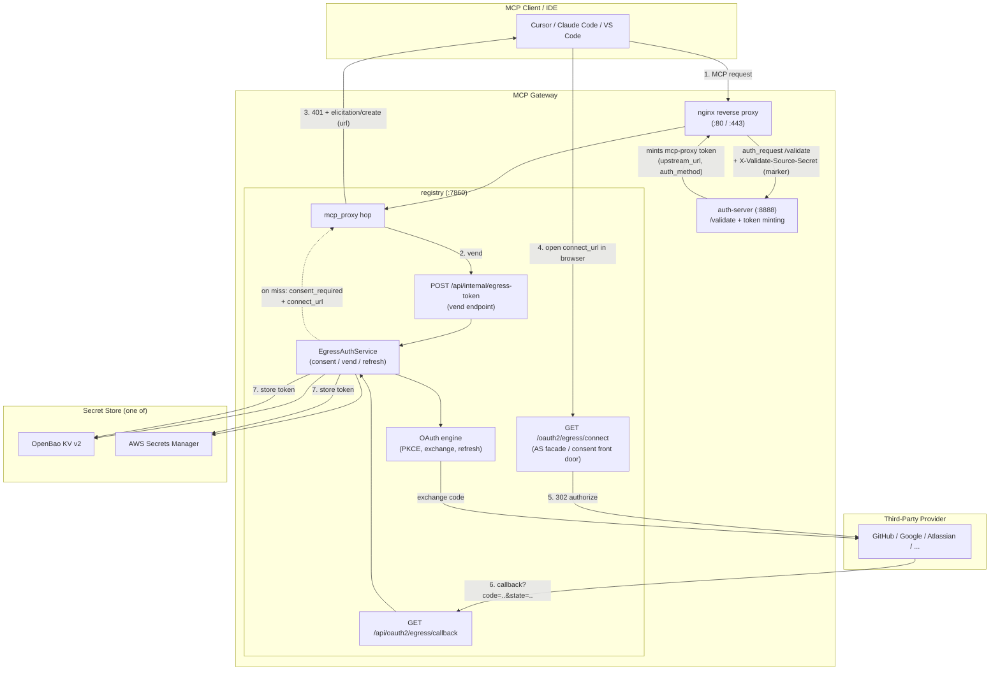
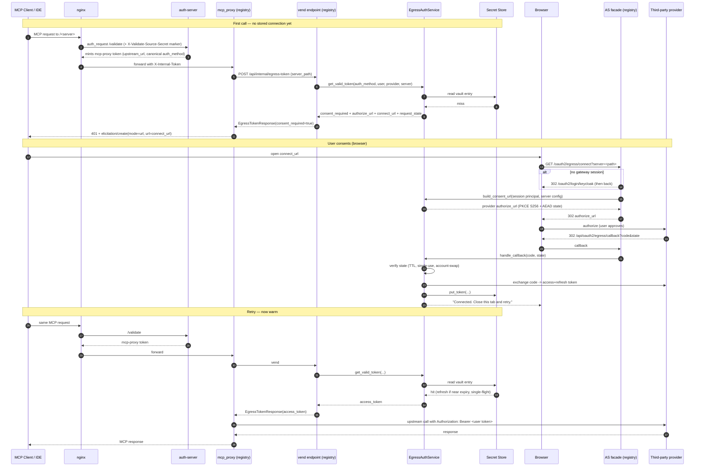

# Per-User Egress Credential Vault (Third-Party OBO)

*Status: Feature documentation. Off by default (`EGRESS_AUTH_ENABLED=false`).*

The per-user egress credential vault lets an MCP agent act **on behalf of** the
end user against a third-party API (GitHub, Google, Atlassian, Microsoft, Slack,
or any custom OIDC provider). Instead of every MCP server holding a single shared
service credential, each user completes a one-time OAuth consent and the gateway
stores **their own** access/refresh tokens in a per-user vault. On every
subsequent call the gateway transparently vends (and refreshes) that user's token
and injects it into the upstream request.

This is the *egress* (outbound) counterpart to the gateway's *ingress* (inbound)
OAuth — ingress authenticates the client **to** the gateway; egress authorizes
the gateway to call a third party **as** the user.

---

## Table of Contents

- [Concepts and terminology](#concepts-and-terminology)
- [Architecture](#architecture)
- [Runtime sequence](#runtime-sequence)
- [Secret store backends](#secret-store-backends)
- [Vault key scheme](#vault-key-scheme)
- [HTTP API surface](#http-api-surface)
- [Environment variables](#environment-variables)
- [Setup: infrastructure (OpenBao / Secrets Manager)](#setup-infrastructure)
- [Setup: configuring an MCP server for egress](#setup-mcp-server)
- [Setup: the IDE / MCP client experience](#setup-ide)
- [Security model](#security-model)
- [Operations and troubleshooting](#operations-and-troubleshooting)

---

## Concepts and terminology

| Term | Meaning |
|------|---------|
| **Egress auth** | Outbound authorization: the gateway calling a third-party API as the user. |
| **OBO (on-behalf-of)** | The agent acts with the user's own delegated authority, not a shared bot identity. |
| **Vault / secret store** | Where per-user third-party tokens live. Two backends: **OpenBao** (EKS/Helm) or **AWS Secrets Manager** (ECS). |
| **Consent** | The one-time OAuth authorize flow the user completes per `(provider, server)`. |
| **Vend** | The internal call that hands a valid third-party access token to the proxy hop at request time. |
| **AS facade** | The gateway's own session-verified "connect" front door (`/oauth2/egress/connect`) that brokers consent — the MCP client itself performs no OAuth. |
| **Marker secret** | A shared secret nginx force-injects on the `/validate` subrequest so a direct `:8888` caller cannot mint an egress-capable token. |
| **Elicitation** | The MCP `elicitation/create` mechanism the gateway uses to ask the client to open the consent URL in a browser. |

---

## Architecture

The feature spans three services. The **registry owns the full feature** (secret
store, OAuth engine, consent facade, vend endpoint). The **auth-server** only mints
the egress-capable proxy token and calls the registry's internal vend endpoint.
**nginx** ties them together and enforces the marker secret.



### Module responsibilities (registry)

| Module | Responsibility |
|--------|----------------|
| `registry/egress_auth/service.py` | `EgressAuthService` — orchestrates consent URL build, callback handling, token vend, single-flight refresh, list, disconnect. |
| `registry/egress_auth/oauth_engine.py` | PKCE generation, `build_authorize_url`, `exchange_code`, `refresh_token`; per-provider token-response parsers and auth styles. |
| `registry/egress_auth/providers.py` | `PROVIDER_REGISTRY` (GitHub, Google, Atlassian, Microsoft, Slack) + `resolve_provider` for custom OIDC. |
| `registry/egress_auth/state_codec.py` | AEAD (AES-256-GCM) encrypt/decrypt of the short-lived OAuth `state` blob — hides the PKCE verifier from the URL/logs. |
| `registry/egress_auth/as_facade.py` | Helpers to test whether a server is egress-configured. |
| `registry/egress_auth/factory.py` | Singleton service wiring; binds the Mongo replay-guard + cross-replica refresh lease (falls back to in-process for single-replica dev). |
| `registry/secrets/interfaces.py` | `SecretStoreBase` ABC: `put_token` / `get_token` / `delete_token` / `list_for_user`. |
| `registry/secrets/keys.py` | Deterministic, collision-free vault-key canonicalization (NFC + base64url). |
| `registry/secrets/factory.py` | Selects and builds the configured backend. |
| `registry/secrets/openbao/store.py` | OpenBao KV v2 backend (one entry per connection; re-auth on token expiry). |
| `registry/secrets/secrets_manager/store.py` | AWS Secrets Manager backend (one JSON-map secret per principal; read-merge-write-verify). |
| `registry/api/egress_auth_routes.py` | Vend endpoint, server-config CRUD, consent initiate, OAuth callback, connections list/delete. |
| `registry/api/egress_oauth_facade_routes.py` | `GET /oauth2/egress/connect` — the session-verified consent front door. |

---

## Runtime sequence

The interesting case is a **cold** call — the user has not yet consented for this
`(provider, server)`. The gateway intercepts, asks the client to open a browser
via MCP elicitation, brokers consent, then the client retries and succeeds.



Key points:

- The **MCP client performs no OAuth itself** — no discovery, no DCR, no token
  exchange. It only opens the gateway-issued `connect_url`. The consent is
  brokered by the gateway's AS facade, which requires a live gateway session.
- The **`connect_url` points at the gateway**, never directly at the provider.
  This is an anti-phishing boundary: the session principal at the facade — not
  any client-supplied value — drives which user the token is stored under.
- The **canonical `auth_method`** ensures consent-write and vend-read address the
  same vault namespace. IdP-specific methods (keycloak, entra, cognito, okta,
  auth0, pingfederate) all canonicalize to `oauth2` so a user does not get asked
  to re-consent on every call.

### Why not point the client straight at the provider?

The vend response actually carries **two** URLs: `authorize_url` (the
provider-direct OAuth URL) and `connect_url` (the gateway's own
`/oauth2/egress/connect` front door). The mcp_proxy hop deliberately puts
**`connect_url`** — not `authorize_url` — in the `elicitation/create` `url`
field. A natural question is: since the callback returns to the gateway anyway,
why not just hand the client the provider's authorize URL directly? Three
reasons make the gateway hop mandatory rather than incidental:

1. **PKCE verifier secrecy.** The provider authorize URL carries a PKCE
   `code_challenge`; its matching `code_verifier` must be held by whoever later
   calls the provider's token endpoint. In this design the **gateway** performs
   the code exchange, so the gateway must own the verifier. The
   [`state_codec`](#architecture) AEAD-encrypts the state precisely so the
   verifier never appears in any URL the client sees. The gateway generates the
   provider URL + verifier server-side, only *after* it has verified the
   session. If the client opened the provider directly, the verifier would
   either have to leak to the client or the client would have to run the token
   exchange itself — defeating the "client performs no OAuth" property.

2. **Session-bound anti-phishing.** `/oauth2/egress/connect` verifies the
   opener's **gateway session** before starting consent and stores the resulting
   token under that *session principal* — never under an identity the client
   asserts. This checkpoint binds "the human who consented" to "the user the
   token is vaulted for." Without it, a leaked or relayed elicitation URL could
   cause user A's third-party token to be stored against user B's vault key.

3. **DCR-free provider support.** Driving the provider's authorize URL directly
   would require the client to be a registered OAuth client at that provider
   (a static `client_id` or RFC 7591 Dynamic Client Registration). Brokering
   through the gateway keeps the single OAuth app credential on the server's
   egress config, so the client needs nothing — and it works with providers
   like Microsoft Entra that do not support DCR.

The callback returning to the gateway is the *back half* of this same flow, not
an independent step: the gateway decrypts the `state` to recover the verifier it
generated, exchanges the code at the provider, and writes the token under the
state-bound principal. Because the **same party (the gateway) both starts
consent and receives the callback**, the flow is internally consistent. Had the
client initiated directly against the provider, the gateway would receive a
callback for a flow it never started — with no verifier to complete the exchange
and no principal binding to know whose vault to write.

---

## Secret store backends

The vault stores the SECRET payload (`StoredToken`: access token, refresh token,
expiry, scopes, status, client_id). Two backends implement the same
`SecretStoreBase` contract:

| Backend | Surface | Layout | Auth |
|---------|---------|--------|------|
| **OpenBao** (`secret_store_backend=openbao`) | EKS / Helm | One KV v2 entry per connection at `{prefix}/{auth}/{user}/{provider}/{server}` | `token`, `kubernetes`, or `approle`; re-authenticates on token expiry. |
| **AWS Secrets Manager** (`secret_store_backend=secrets-manager`) | ECS / Terraform | One secret per principal holding a JSON map `{map_key: StoredToken}` | IAM task role; optional CMK for envelope encryption. Read-merge-write-verify for concurrent writers. |

> There is no local file backend. `secret_store_backend` accepts only
> `openbao` or `secrets-manager`. The default is `openbao`.

---

## Vault key scheme

The vault key is the tuple `(auth_method, user_id, provider, server_path)`. Raw
values are not safe as path/map segments (Auth0 `sub` contains `|`, Keycloak
usernames contain spaces/accents, `server_path` contains `/`). Every backend
builds keys through `registry/secrets/keys.py`, which applies **one** canonical
encoding: NFC-normalize, then **base64url (unpadded)**, so each segment contains
only `[A-Za-z0-9_-]` — never `/`, `|`, `%`, or `=`.

```
per-principal prefix:   {prefix}/enc(auth_method)/enc(user_id)
OpenBao entry path:     {prefix}/enc(auth_method)/enc(user_id)/enc(provider)/enc(server_path)
Secrets Manager secret: {prefix}/enc(auth_method)/enc(user_id)
   map key within it:   enc(provider)|enc(server_path)
```

base64url is used deliberately over percent-encoding: hvac re-quotes the path it
is given, turning a percent-encoded `/` (`%2F`) into `%252F` on the wire, which
defeats OpenBao path routing. base64url has no reserved characters and survives
unchanged.

---

## HTTP API surface

All routes are under the registry. The egress routes are mounted with the `/api`
prefix; the AS facade is mounted at root and registered only when
`EGRESS_AUTH_ENABLED=true`.

### Internal (proxy-facing)

| Method | Path | Auth | Purpose |
|--------|------|------|---------|
| `POST` | `/api/internal/egress-token` | mcp-registry service JWT + re-verified `X-Internal-Token` | Vend a valid third-party token for the proxy hop, or return `consent_required` + the connect URL. |

### Server configuration (admin)

| Method | Path | Auth | Purpose |
|--------|------|------|---------|
| `POST` | `/api/servers/{server_path}/egress-auth` | proxied auth + admin | Configure egress OAuth on a server (provider, client_id, write-only encrypted client_secret, scopes, custom URLs). |
| `GET` | `/api/servers/{server_path}/egress-auth` | proxied auth + admin | Read the non-secret egress config (secret stripped). |

### End-user

| Method | Path | Auth | Purpose |
|--------|------|------|---------|
| `POST` | `/api/egress-auth/initiate` | user session | Web-only: begin consent for the current user; returns the provider `authorize_url`. |
| `GET` | `/api/egress-auth/connections` | user session | List the user's connected accounts (tokens stripped). |
| `DELETE` | `/api/egress-auth/connections/{provider}/{server_path}` | user session + CSRF | Revoke a connection. |

### OAuth / browser

| Method | Path | Auth | Purpose |
|--------|------|------|---------|
| `GET` | `/oauth2/egress/connect` | gateway session (bounces to login if none) | AS-facade front door for MCP URL-mode elicitation; 302s to the provider. |
| `GET` | `/api/oauth2/egress/callback` | none (the AEAD `state` is the authority) | Provider redirect target; verifies state, exchanges the code, stores the token. |

---

## Environment variables

All settings live in `registry/core/config.py`. The registry owns the **full**
set; the auth-server needs only `EGRESS_AUTH_ENABLED`, `EGRESS_REGISTRY_INTERNAL_URL`,
and `AUTH_SERVER_NGINX_MARKER_SECRET`.

| Env var | Default | Purpose |
|---------|---------|---------|
| `EGRESS_AUTH_ENABLED` | `false` | Master switch. When true, requires a Mongo-family `STORAGE_BACKEND` and a non-empty `EGRESS_OAUTH_CALLBACK_BASE_URL` (validated at startup). |
| `SECRET_STORE_BACKEND` | `openbao` | Vault backend: `openbao` \| `secrets-manager`. |
| `EGRESS_OAUTH_CALLBACK_BASE_URL` | `""` | Public base URL for the callback (`{base}/oauth2/egress/callback`). Typically the gateway's external URL. |
| `EGRESS_TOKEN_REFRESH_SKEW_SECONDS` | `300` | Refresh a vaulted token this many seconds before expiry. |
| `EGRESS_REFRESH_WORKER_INTERVAL_SECONDS` | `120` | Background proactive-refresh scan interval; `0` disables the sweep. |
| `EGRESS_STATE_TTL_SECONDS` | `600` | Lifetime of the AEAD-encrypted OAuth consent state. |
| `EGRESS_REGISTRY_INTERNAL_URL` | `http://registry:8080` | URL the auth-server uses to reach the registry's internal vend endpoint. |
| `AUTH_SERVER_NGINX_MARKER_SECRET` | `""` | Shared secret nginx force-sets on `/validate`. Empty disables the marker (mints unconditionally). Set a strong random value in production. **(secret)** |
| `AWS_SECRETS_REGION` | `""` | AWS region (required when `SECRET_STORE_BACKEND=secrets-manager`). |
| `SECRETS_MANAGER_KMS_KEY_ID` | `""` | Optional CMK for envelope encryption; empty uses the AWS-managed key. **(secret)** |
| `SECRETS_MANAGER_PATH_PREFIX` | `mcp/egress` | Secret-name prefix; also scopes the ECS task IAM grant. |
| `OPENBAO_ADDR` | `""` | OpenBao server address (required when `SECRET_STORE_BACKEND=openbao`). |
| `OPENBAO_NAMESPACE` | `""` | OpenBao namespace (Enterprise only). |
| `OPENBAO_KV_MOUNT` | `secret` | OpenBao KV v2 mount point. |
| `OPENBAO_AUTH_METHOD` | `token` | `token` \| `kubernetes` \| `approle`. |
| `OPENBAO_ROLE` | `""` | OpenBao role (required for `kubernetes`/`approle` auth). |

See [`unified-parameter-reference.md`](unified-parameter-reference.md) for the
Docker / Terraform / Helm name mapping of each parameter.

---

<a id="setup-infrastructure"></a>
## Setup: infrastructure (OpenBao / Secrets Manager)

The feature needs (a) a Mongo-family operational store for the cross-replica
refresh lease, and (b) a secret store backend.

### EKS / Helm (OpenBao)

The Helm stack ships a standalone OpenBao deployment as a separate, opt-in
concern (see the OpenBao infrastructure chart/PR). Once it is available:

```yaml
# charts/mcp-gateway-registry-stack/values.yaml
openbao:
  enabled: true          # deploy the bundled standalone OpenBao

registry:
  egressAuth:
    enabled: true
    secretStoreBackend: openbao
    oauthCallbackBaseUrl: "https://mcpgateway.example.com"
    openbao:
      kvMount: secret
      authMethod: kubernetes
      role: registry      # bound to the registry ServiceAccount by the init Job
```

The bundled OpenBao runs sealed-on-boot with file storage on a PVC; an init Job
performs one-time `operator init` (Shamir 1-of-1), stores the unseal key + root
token in a Kubernetes Secret, enables `kubernetes` auth, writes the `mcp-egress`
policy, and creates the role bound to the registry ServiceAccount. An unseal
sidecar re-unseals on every restart. The registry then authenticates to OpenBao
with its projected ServiceAccount token (no static token to rotate).

For local development against a throwaway OpenBao:

```bash
scripts/run-openbao-dev.sh start    # in-memory dev server on :8200, KV v2 at secret/
export OPENBAO_TEST_ADDR=http://127.0.0.1:8200
export OPENBAO_TEST_TOKEN=dev-root-token
uv run pytest tests/integration/test_openbao_secret_store.py -v
scripts/run-openbao-dev.sh stop
```

### ECS / Terraform (Secrets Manager)

On ECS the natural backend is AWS Secrets Manager. In `terraform.tfvars`:

```hcl
egress_auth_enabled               = true
egress_secret_store_backend       = "secrets-manager"
egress_oauth_callback_base_url    = "https://mcpgateway.example.com"
egress_secrets_manager_path_prefix = "mcp/egress"
# egress_secrets_manager_kms_key_id = "arn:aws:kms:...:key/..."  # optional CMK
egress_nginx_marker_secret        = "<strong-random-value>"
```

Terraform grants the task role `secretsmanager` (+ `kms` when a CMK is set)
access scoped to the path prefix when `egress_auth_enabled` is true.

### Docker Compose (single host)

In `.env`:

```bash
EGRESS_AUTH_ENABLED=true
SECRET_STORE_BACKEND=openbao            # or secrets-manager
EGRESS_OAUTH_CALLBACK_BASE_URL=https://mcpgateway.example.com
AUTH_SERVER_NGINX_MARKER_SECRET=<strong-random-value>
# OpenBao:
OPENBAO_ADDR=http://openbao:8200
OPENBAO_AUTH_METHOD=token
# (provide OPENBAO_TOKEN/VAULT_TOKEN via the environment for token auth)
# or Secrets Manager:
# AWS_SECRETS_REGION=us-east-1
# SECRETS_MANAGER_PATH_PREFIX=mcp/egress
```

> `EGRESS_AUTH_ENABLED=true` requires a Mongo-family `STORAGE_BACKEND`
> (`documentdb` / `mongodb-ce` / `mongodb` / `mongodb-atlas`). The refresh
> single-flight lock has no home on the `file` backend, so startup fails fast
> with a clear error otherwise.

---

<a id="setup-mcp-server"></a>
## Setup: configuring an MCP server for egress

Egress OAuth is configured **per MCP server** by an admin. You need an OAuth app
registered with the provider, with its redirect/callback URL set to
`{EGRESS_OAUTH_CALLBACK_BASE_URL}/oauth2/egress/callback`.

Built-in providers: `github`, `google`, `atlassian`, `microsoft`, `slack`. Any
other provider uses `custom` with explicit `custom_authorize_url` /
`custom_token_url`.

Configure via the API (or the server-edit modal in the UI):

```bash
curl -X POST "https://mcpgateway.example.com/api/servers/github-mcp/mcp/egress-auth" \
  -H "Authorization: Bearer <admin-token>" \
  -H "Content-Type: application/json" \
  -d '{
        "egress_auth_mode": "oauth_user",
        "egress_provider": "github",
        "client_id": "Iv1.abc123",
        "client_secret": "<oauth-app-secret>",
        "scopes": ["repo", "read:user"]
      }'
```

- `egress_auth_mode`: `none` (default, feature off for this server) or
  `oauth_user` (per-user OBO).
- `client_secret` is **write-only** — it is Fernet-encrypted with the gateway
  `SECRET_KEY` at rest and never returned by the `GET` endpoint. Rotating
  `SECRET_KEY` invalidates stored secrets.
- The `GET` response includes the `callback_url` to register in the provider's
  OAuth app.

For a custom OIDC provider:

```jsonc
{
  "egress_auth_mode": "oauth_user",
  "egress_provider": "custom",
  "client_id": "...",
  "client_secret": "...",
  "scopes": ["openid", "profile"],
  "custom_authorize_url": "https://idp.example.com/oauth/authorize",
  "custom_token_url": "https://idp.example.com/oauth/token"
}
```

---

<a id="setup-ide"></a>
## Setup: the IDE / MCP client experience

No special client configuration is required beyond connecting the MCP server
through the gateway as usual. The client must support MCP **elicitation**
(`elicitation/create` with `mode: "url"`), which is how the gateway asks the user
to open the consent page.

End-user flow:

1. The user invokes a tool on an egress-configured server through their IDE
   (Cursor, Claude Code, VS Code, etc.).
2. On the first call the gateway returns a `401` carrying an `elicitation/create`
   with the gateway-issued **connect URL**. The client opens it in a browser.
3. If the user has no live gateway session, the connect page bounces them to the
   gateway login (e.g. Keycloak) first, then continues.
4. The user approves at the provider's consent screen. The browser shows
   "Connected — close this tab and retry."
5. The user re-runs the tool. The gateway now vends the stored token
   transparently; no further prompts until the refresh token dies or is revoked.

Users can review and revoke their connections in the UI at **Connected Accounts**
(sidebar entry), which is backed by `GET`/`DELETE /api/egress-auth/connections`.

---

## Security model

- **Marker secret (fail-closed).** nginx force-sets `X-Validate-Source-Secret` on
  the internal `/validate` subrequest. When `AUTH_SERVER_NGINX_MARKER_SECRET` is
  set, the auth-server mints an egress-capable proxy token **only** if the marker
  matches — so a direct caller hitting `:8888` with a forged `X-Resolved-Upstream`
  cannot obtain one. Empty marker disables the check (mints unconditionally).
- **Upstream cross-check.** The vend endpoint re-verifies the internal token and
  confirms the token's `upstream_url` falls within the registered server's
  `proxy_pass_url` (and version allowlist) before vending — a forged upstream is
  rejected.
- **Anti-phishing consent.** The connect URL points at the gateway, not the
  provider. The AS facade requires a live gateway session and stores the token
  under the **session** principal, not any client-asserted identity.
- **State confidentiality.** The OAuth `state` is AES-256-GCM encrypted (not
  merely signed) so the PKCE verifier never appears in a URL, `Referer`, or log.
  The service enforces TTL, single-use (replay guard), and an account-swap guard.
- **Per-user isolation.** Tokens are namespaced by `(auth_method, user_id,
  provider, server_path)`; a `network-trusted`/static caller named "alice"
  cannot read OAuth user "alice"'s tokens (distinct `auth_method` buckets).
- **Secret-at-rest.** OAuth app client secrets are Fernet-encrypted with
  `SECRET_KEY`. Per-user tokens live only in the vault backend (OpenBao /
  Secrets Manager), never in the app database.

---

## Operations and troubleshooting

| Symptom | Likely cause / fix |
|---------|--------------------|
| Startup fails: "requires a Mongo-family STORAGE_BACKEND" | `EGRESS_AUTH_ENABLED=true` with `STORAGE_BACKEND=file`. Switch to a Mongo-family backend. |
| Startup fails: "requires EGRESS_OAUTH_CALLBACK_BASE_URL" | Set the public callback base URL. |
| Client never gets a consent prompt | The MCP client must support `elicitation/create` (url mode). Check the server's `egress_auth_mode` is `oauth_user`. |
| Consent loops (re-asked every call) | Usually an `auth_method` mismatch between consent-write and vend-read — confirm the IdP method canonicalizes to `oauth2`. Or the stored refresh token is dead (provider revoked it) → re-consent. |
| Vend returns 401 from auth-server | Marker secret mismatch. Ensure `AUTH_SERVER_NGINX_MARKER_SECRET` matches on registry + auth-server, and nginx sets it on `/validate`. |
| OpenBao reads fail with permission denied | The role token lapsed. The store re-authenticates and retries once; persistent failure means a real policy/role gap — verify the `mcp-egress` policy and the role binding to the registry ServiceAccount. |
| `decrypt` errors on client secret | `SECRET_KEY` was rotated after the server's egress config was saved. Re-save the egress config with the client secret. |

### Related documentation

- [Unified Parameter Reference](unified-parameter-reference.md) — per-surface variable names.
- [Token Refresh Service](token-refresh-service.md) — the inbound token refresher (distinct from egress refresh).
- [OAuth Discovery Endpoints](oauth-discovery-endpoints.md) — inbound RFC 9728/8414 discovery.
- [Authentication Guide](auth.md) — gateway ingress authentication.
