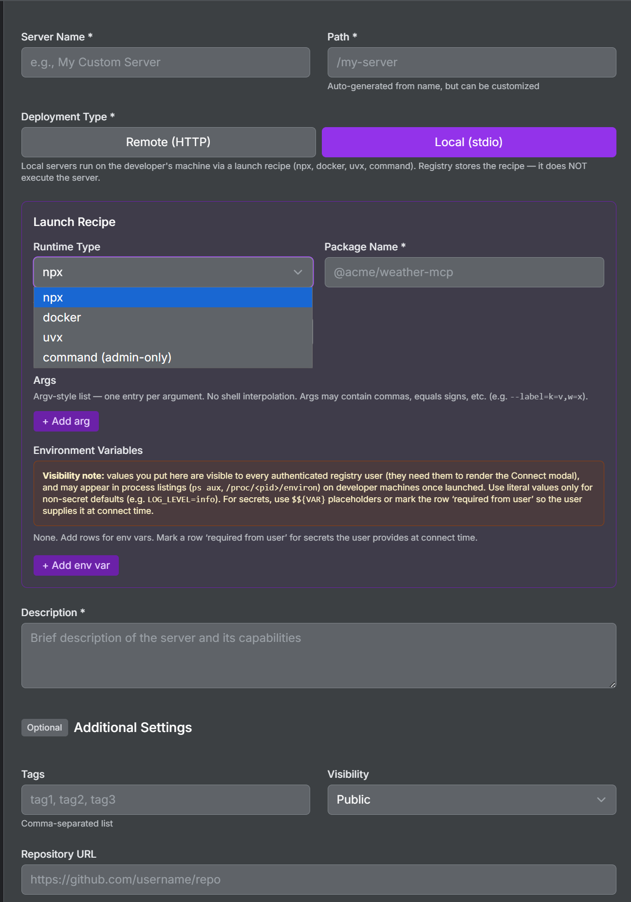

# Do you support local (stdio) MCP servers?

## Question

I have an MCP server that runs on the developer's machine via stdio (launched by `npx`, `uvx`, `docker run`, or a command-line binary). It doesn't have an HTTP endpoint. Can I register it in the registry so my team can discover and connect to it from their IDEs?

## Answer

Yes. The registry supports two deployment types:

- **Remote** (default): HTTP-proxied servers with a `proxy_pass_url`. The registry health-checks them, generates nginx routes, and security-scans them.
- **Local**: Stdio-launched servers with a launch recipe (`local_runtime`). The registry stores the recipe and surfaces it as IDE-ready config through the Connect modal. No health checks, no proxy, no security scanning.

Local servers appear in the same server listing, semantic search, and Discover tab as remote servers, but with a "LOCAL" badge and a "stdio" health indicator instead of the usual healthy/unhealthy dot.

## How to register a local server

### Via the UI

1. Go to **Register New Service**
2. Under **Deployment Type**, select **Local (stdio)**
3. Fill in the **Launch Recipe** (runtime type, package, version, args, env vars)
4. Submit



### Via the API (Bearer token)

```bash
ACCESS_TOKEN=$(jq -r '.tokens.access_token' .token)
curl -X POST -H "Authorization: Bearer $ACCESS_TOKEN" \
  -F "name=My Local MCP" \
  -F "description=A stdio MCP server" \
  -F "path=/my-local-mcp" \
  -F "deployment=local" \
  -F 'local_runtime={"type":"npx","package":"@acme/weather-mcp","version":"1.2.0","args":["--verbose"],"env":{"LOG_LEVEL":"info"},"required_env":["API_KEY"]}' \
  -F "tags=weather,local" \
  "$REGISTRY_URL/api/servers/register"
```

### Via the CLI

```bash
uv run python api/registry_management.py register --config my-local-server.json
```

Where `my-local-server.json` contains:

```json
{
  "name": "My Local MCP",
  "description": "A stdio MCP server",
  "path": "/my-local-mcp",
  "deployment": "local",
  "local_runtime": {
    "type": "npx",
    "package": "@acme/weather-mcp",
    "version": "1.2.0",
    "args": ["--verbose"],
    "env": {"LOG_LEVEL": "info"},
    "required_env": ["API_KEY"]
  },
  "tags": "weather,local"
}
```

## Runtime types

| Type | Launcher | Example package |
|------|----------|-----------------|
| `npx` | Node.js package runner | `@acme/weather-mcp` |
| `uvx` | Python package runner (uv) | `adeu` |
| `docker` | Docker container | `docker.io/acme/mcp:1.0` |
| `command` | Raw executable (admin-only, highest trust) | `/usr/local/bin/my-mcp` |

## Environment variables and secrets

The `env` field stores literal values or `${VAR}` placeholders visible to all authenticated registry users (needed to render the Connect modal). The `required_env` field lists variable names the user must supply at connect time.

**Important:** Never put real secrets in `env`. The registry rejects obvious literal secrets at registration time (known prefixes like `sk-`, `ghp_`, `AKIA`, and long high-entropy strings). For secrets, either:
- Use `${VAR}` placeholders: `"env": {"TOKEN": "${MY_TOKEN}"}`
- Use `required_env`: `"required_env": ["API_KEY"]` (user provides at connect time)

## What happens in the Connect modal?

When a user clicks Connect on a local server, the modal shows a launch recipe formatted for their chosen IDE:

- **Claude Code**: `claude mcp add server-name -e KEY="value" -- npx -y @package@version`
- **Cursor / Generic JSON**: `{"mcpServers": {"server-name": {"command": "npx", "args": ["-y", "@package@version"], "env": {...}}}}`
- **Goose**: YAML with `type: stdio`, `cmd`, `args`, `envs`

No JWT token or gateway URL is shown (local servers don't go through the gateway).

## What about security?

- Local server registration requires **admin privileges**
- A `security-pending-local` tag is auto-added at registration (no automated scan is possible for stdio servers)
- Admins can clear the tag after manual review via **Clear Security Pending** button or the API endpoint `POST /api/clear-security-pending-local/{path}`
- Servers without a version pin (npx/uvx without `version`, docker without `image_digest`) are auto-tagged `unpinned-version` for visibility

## What about federation?

Local servers are **never exported** to federation peers by default. A peer must explicitly opt in by setting `sync_local_servers: true` in their peer configuration. This is a trust boundary: local recipes contain executable commands, so syncing them is an explicit decision.

## What stays the same?

- Existing remote servers are completely unaffected
- The `deployment` field defaults to `"remote"` for all pre-existing entries
- No database migration required (new fields are additive)
- The Anthropic-compatible API (`/api/registry/v0.1/servers`) filters out local servers (they're not HTTP endpoints)

## Frequently asked questions

**Q: Can I switch a server from remote to local (or vice versa)?**
A: No. Deployment type is immutable after registration. Delete and re-register if you need to change it.

**Q: Do local servers count against my server quota?**
A: Yes, they appear in the total server count like any other server.

**Q: Can non-admin users register local servers?**
A: No. Local registration distributes executable launch recipes to developer machines, so it requires admin privileges.

**Q: Why is health status always "local"?**
A: The registry has nothing to probe. Stdio servers run on the user's machine, not on a network endpoint. The "local" status means "this server is registered and available for connection but not health-checked."
