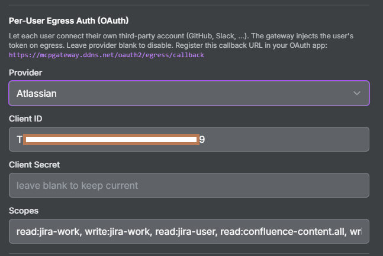
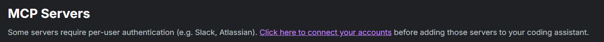
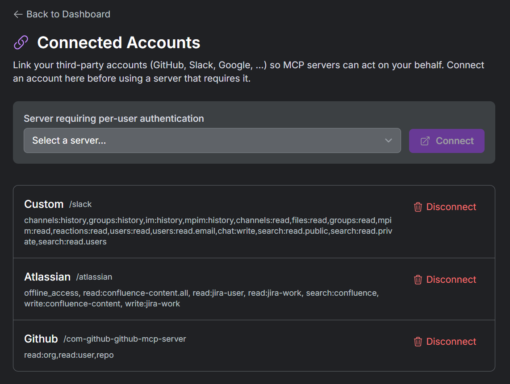

# How do I register commonly used third-party MCP servers like GitHub, Slack, and Atlassian?

Popular hosted third-party MCP servers (GitHub, Slack, Atlassian) require
per-user authentication (egress OAuth / 3LO). For the full egress credential
vault model, see [Per-User Egress Credential Vault](../egress-credential-vault.md).

These are hosted MCP servers run by the third-party SaaS provider (GitHub,
Slack, Atlassian). Each user connects their own account once; the gateway
vaults that user's token and injects it on egress, so the coding assistant
never handles the token. Here is the end-to-end flow.

### 1. Register the server

Three ready-to-use registration files are provided under
[`cli/examples/`](../../cli/examples/):

| Server | File | `proxy_pass_url` (edit as needed) |
|--------|------|-----------------------------------|
| GitHub | [`github-mcp-server.json`](../../cli/examples/github-mcp-server.json) | `https://api.githubcopilot.com/mcp/` |
| Slack | [`slack-mcp-server.json`](../../cli/examples/slack-mcp-server.json) | `https://mcp.slack.com/mcp` |
| Atlassian | [`atlassian-mcp-server.json`](../../cli/examples/atlassian-mcp-server.json) | `https://mcp.atlassian.com/v1/mcp` |

The `proxy_pass_url` values point at the third-party SaaS-hosted MCP endpoints.
**Edit these as needed** — if you run a self-hosted version of one of these MCP
servers, change the URL to your own endpoint.

Register each server the usual way (Register button in the UI, or the CLI):

```bash
uv run python api/registry_management.py --registry-url http://localhost --token-file .token \
  register --config cli/examples/github-mcp-server.json
```

### 2. Configure egress auth through the UI

After the server is registered, open it and click **Edit**. Scroll to the
**Per-User Egress Auth (OAuth)** section and configure the provider. You can
either:

- **Select a built-in provider** from the dropdown (e.g. GitHub, Slack,
  Atlassian, Google, Microsoft), which pre-fills the provider's authorize/token
  endpoints, or
- **Select the generic OIDC (custom) provider** and supply the authorize URL,
  token URL, and scope separator yourself (useful for self-hosted or
  not-yet-built-in providers).

Enter your OAuth app's **client_id** and **client_secret**, and the **scopes**.

> Register the gateway callback URL in your provider's OAuth app first:
> `https://<your-registry-domain>/oauth2/egress/callback` (matched exactly). The
> provider is carried in the signed state, so the same callback URL is used for
> every provider.



#### Reference scopes to get basic functionality working

Use these scopes as a starting point, then **edit them as needed based on each
provider's specification** and how much access you want to grant.

**GitHub** (provider: `github`):

```
read:org,read:user,repo
```

**Slack** (provider: `custom` — Slack's user-token endpoints; see the notes in
`slack-mcp-server.json`):

```
channels:history,groups:history,im:history,mpim:history,channels:read,files:read,groups:read,mpim:read,reactions:read,users:read,users:read.email,chat:write,search:read.public,search:read.private,search:read.users
```

**Atlassian** (provider: `atlassian` — Jira + Confluence):

```
offline_access,read:confluence-content.all,read:jira-user,read:jira-work,search:confluence,write:confluence-content,write:jira-work
```

> Enter scope values as plain strings (e.g. `repo`), not quoted (`"repo"`).
> Always include `offline_access` for Atlassian so a refresh token is issued.

### 3. Connect your account (one-time 3LO consent)

After the server is configured, go to the **MCP Servers** page and click the
**"Click here to connect your accounts"** link. On the Connected Accounts page,
select your server from the dropdown and click **Connect**.





This starts the third-party OAuth (3LO) flow in your browser. Approve access at
the provider; once completed, the gateway **automatically vaults your token**.
That's it — you are ready.

### 4. Add the server to your coding assistant

Back on the MCP Servers page, click the **Connect** button on the server card to
get the connection command, and add the server to Claude Code, Codex, or your
coding assistant of choice. For example, adding the GitHub server to Claude Code:

```bash
claude mcp add --transport http com-github-github-mcp-server \
  https://mcpgateway.ddns.net/com-github-github-mcp-server
```

(Use your own gateway domain and the server's path; the Connect dialog on the
card generates the exact command for your deployment.) You are good to go — the
assistant sees the server's real tools, and the gateway injects your vaulted
per-user token on every call.

## Do I have to connect before adding the server to my coding assistant?

It is recommended. If you add the server before connecting, the coding assistant
will connect but see no tools (the tool list requires your token). Connect via
the Connected Accounts page first, then the real tools appear. If you try to use
a tool before connecting, the gateway returns a message containing the connect
URL so you can self-serve.

## The consent page shows "no supported scopes" or scopes look wrong — what happened?

Enter scope values as **plain strings** (`repo`, `read:jira-work`), not quoted
(`"repo"`). Quoted values are sent to the provider literally, which the provider
rejects as invalid scopes. Also confirm the same scopes are enabled in your
provider's OAuth app (the app must actually grant what the gateway requests).
