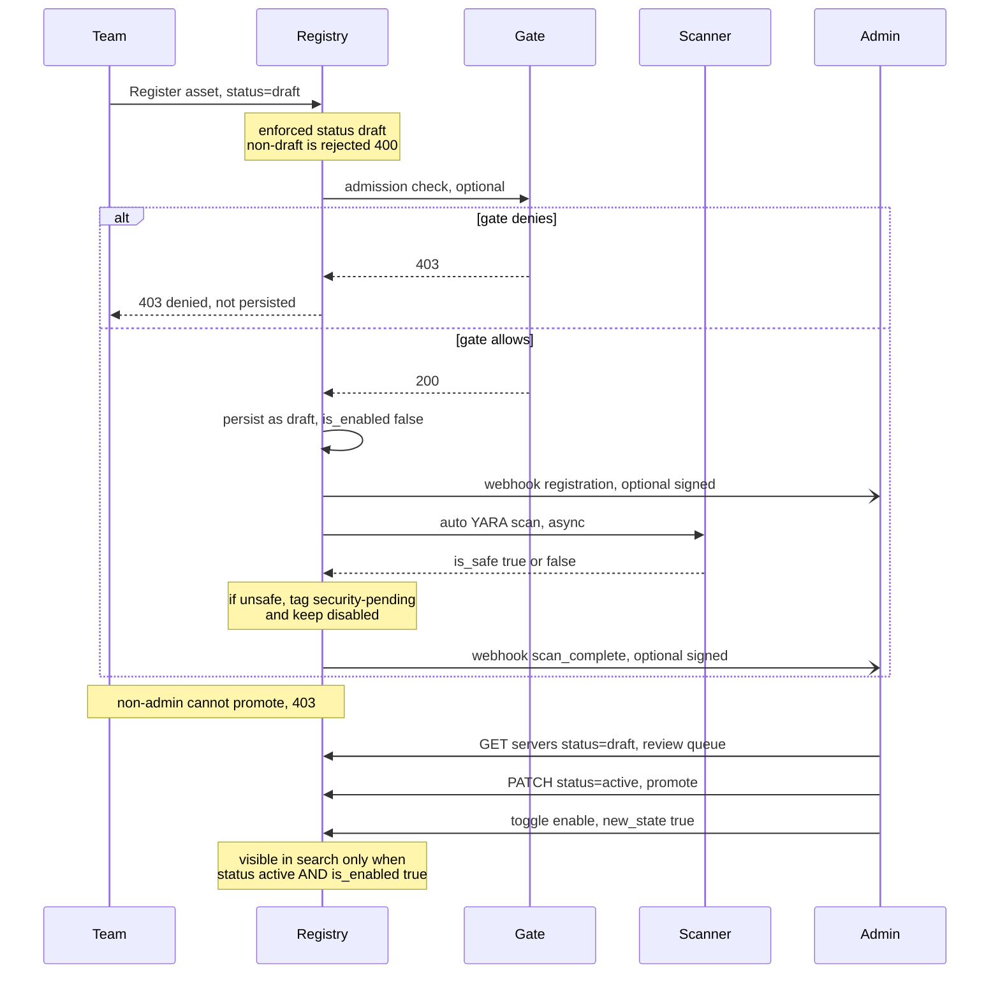

# How do I set up a self-service workflow for AI assets (draft → review → active)?

> **Demo video:** [Watch the end-to-end walkthrough](https://app.vidcast.io/share/1313ea6e-2766-4380-88a6-c5142ee30a33) (read-all user registers a server into draft, admin promotes it to active, and it becomes discoverable in search).

## Question

I want teams to be able to register their own MCP servers, agents, and skills, but I do not want anything to become live and discoverable until it has been reviewed. Concretely:

- A regular (non-admin) user can register a new asset, but it must land in a **draft** state.
- That user must **not** be able to promote their own asset to active.
- An admin (or an automated CI/CD pipeline) reviews drafts and promotes them to active, or
  deprecates them.
- Optionally, the registry should notify a pipeline or an admin when an asset needs review.

How do I assemble this from the registry's building blocks?

## Answer

This is an **example workflow** built entirely from existing registry features: a group scope, one configuration parameter, an optional webhook, and the lifecycle status API. The workflow itself (the CI/CD pipeline, the review UI, any notifications) lives **outside** the registry. The registry provides the primitives; you wire them together to match your governance process.

### The workflow this example implements

The diagram below shows the end-to-end flow across five actors: a non-admin **Team** member registering an asset, the **Registry**, an optional external **Gate** (admission control, the "quick checks"), the in-registry **Security Scan**, and the **Admin** (or CI/CD pipeline) that reviews and promotes. The two external integration points are optional and independent: the **gate** is synchronous and can block (returns 200/403); the **webhook** is asynchronous and only notifies.



The rest of this FAQ walks through how to set each piece up.

### Step 1: Create the read-write user group (register, but not promote)

Create a non-admin group that can register assets but **cannot** change lifecycle status. The registry already ships an example group, `read-all-register-new`, that grants `register_service` and `list_service` but deliberately omits `change_lifecycle_status` (and `toggle_service`, `modify_service`, `delete_service`). Import it and create a matching IdP group of the same name:

```bash
uv run python api/registry_management.py \
  --registry-url https://your-registry.example.com \
  --token-file .oauth-tokens/ingress.json \
  import-group --file cli/examples/read_all_register_new.json
```

Members of this group can register an asset, but a request that changes the `status` field returns **403** because they lack the `change_lifecycle_status` permission. That permission is granted only to admins (it is present in `scripts/registry-admins.json` and `scripts/mcp-registry-admin.json`). This is what enforces "register yes, promote no".

See [How do I create a non-admin group that can register servers and run health checks but cannot toggle, edit, or delete them?](read-write-non-admin-group.md) for the full anatomy of this group scope.

### Step 2: Force new assets to start as draft

Set the `REGISTRATION_ENFORCED_STATUS` parameter so that every new registration must start as `draft`:

```bash
REGISTRATION_ENFORCED_STATUS=draft
```

With this set:

- A registration with no status is forced to `draft`.
- A registration with a different explicit status (e.g. `active`) fails with **HTTP 400** and
  a clear message.
- A registration that explicitly passes `status=draft` succeeds.

When the parameter is unset (the default), behavior is unchanged: new assets default to `active` (skills already default to `draft`). This parameter is available on all deployment surfaces; see the row for `REGISTRATION_ENFORCED_STATUS` in [the unified parameter reference](../unified-parameter-reference.md).

### Step 3 (optional): Configure webhooks to notify a pipeline or admin

Webhooks are **optional**. They let the registry actively notify an external CI/CD pipeline or an admin that there is something to review, instead of the pipeline or admin polling.

```bash
REGISTRATION_WEBHOOK_URL=https://your-pipeline.example.com/registry-events
# Optional auth on the outbound call:
REGISTRATION_WEBHOOK_AUTH_HEADER=Authorization
REGISTRATION_WEBHOOK_AUTH_TOKEN=your-token
# Optional HMAC signing so the consumer can verify authenticity:
REGISTRATION_WEBHOOK_SIGNING_SECRET=your-shared-secret
```

With this configured, the registry fires:

- A `registration` event when an asset is registered.
- A `scan_complete` event when the asynchronous security scan finishes (carrying `is_safe`,
  severity counts, applied tags, and whether the asset was auto-disabled).

Your pipeline consumes these events and decides what to do: run extra checks, promote the asset to `beta`, or notify a human. See [Registration Webhooks and Gate](../registration-webhooks.md) for the payload shapes, the signature verification recipe, and the event-ordering/replay guidance.

**If you do not configure webhooks, nothing breaks.** The admin path in Step 4 works entirely on its own.

### Step 4: An admin (or pipeline) reviews drafts and promotes them

Whether or not webhooks are configured, an admin can always pull the list of assets awaiting review using the lifecycle status filter, and then change their status.

**List the draft assets** (the review queue):

```bash
curl -sS "https://your-registry.example.com/api/servers?status=draft" \
  -H "Authorization: Bearer $ACCESS_TOKEN" | jq '[.[] | {path, server_name: .display_name, status}]'
```

`status=active` also matches legacy assets that have no status field. The same filter works for building a "review beta list".

**Promote a draft to active** — either via the management CLI:

```bash
uv run python api/registry_management.py \
  --registry-url https://your-registry.example.com \
  --token-file .oauth-tokens/ingress.json \
  patch-server --path /my-server --patch '{"status": "active"}'
```

…or by calling the API directly:

```bash
curl -sS -X PATCH "https://your-registry.example.com/api/servers/my-server" \
  -H "Authorization: Bearer $ADMIN_TOKEN" \
  -H "Content-Type: application/json" \
  -d '{"status": "active"}'
```

…**or** by an admin going to the registry UI and changing the status to active manually.

To reject an asset instead, set its status to `deprecated` the same way. Search hides `draft` and `deprecated` assets by default, so promoting to `active` is what makes an asset "visible to all".

> The same flow applies to agents and skills. Use `agent-patch` / the agent and skill PATCH
> endpoints, or the UI, with the `change_lifecycle_status` permission.

### Important: failed security scan ≠ draft status

Lifecycle status and the enabled/disabled toggle are **two independent things**. Do not conflate them.

- **Lifecycle status** (`draft` / `beta` / `active` / `deprecated`) is the editorial/review
  state described above. It is what the self-service workflow drives.
- **Enabled / disabled** (`is_enabled`) is an operational switch. When the automated security
  scan **fails**, the asset is registered but **disabled** (if `SECURITY_BLOCK_UNSAFE_SERVERS` is enabled) and tagged `security-pending`. This is a separate, admin-override style control, not a lifecycle status change.

Key consequences:

- A **disabled** asset does **not** appear in search results and does not receive traffic,
  regardless of its lifecycle status. So even an asset whose status is `active` stays hidden while it is disabled.
- After reviewing the security findings, an **admin can enable** the asset (via the toggle
  endpoint or the UI). Only then does it become discoverable.
- Promoting lifecycle status (`draft` → `active`) does **not** enable a disabled asset, and
  enabling an asset does **not** change its lifecycle status. An asset must be both `is_enabled = true` **and** at a visible lifecycle status (`active` or `beta`) to show up in search.

This separation is deliberate: the security scan result is an operational safety gate that an admin controls, while lifecycle status is the review workflow that this FAQ describes.

## Summary

| Goal | Mechanism |
|------|-----------|
| Non-admin can register but not promote | `read-all-register-new` group (has `register_service`, lacks `change_lifecycle_status`) |
| New assets start as draft | `REGISTRATION_ENFORCED_STATUS=draft` |
| Notify a pipeline/admin (optional) | `REGISTRATION_WEBHOOK_URL` + `scan_complete` / `registration` events |
| Find assets awaiting review | `GET /api/servers?status=draft` |
| Promote or reject | `patch-server --patch '{"status":"active"}'`, the PATCH API, or the UI (admin only) |
| Unsafe asset blocked from search | Failed security scan disables the asset (`is_enabled=false`), independent of lifecycle status; an admin re-enables it |

## Related

- [Registration Webhooks and Gate](../registration-webhooks.md)
- [How do I create a non-admin read-write group?](read-write-non-admin-group.md)
- [Unified parameter reference](../unified-parameter-reference.md)
