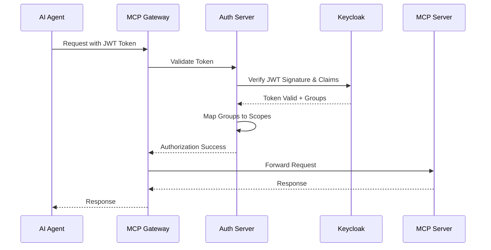

# Keycloak: Agent M2M & Operations Guide

> **Scope of this doc**: Keycloak setup for **agent-to-gateway machine-to-machine
> (M2M) authentication** using service accounts, plus operational procedures
> (start/stop, backup/restore, agent lifecycle, monitoring).
>
> **Looking for end-user MCP clients?** If you're trying to get Claude Code,
> Claude.ai connectors, Cursor, Roo Code, or Kiro talking to the gateway via
> Dynamic Client Registration (DCR) and OAuth, see the companion doc:
> [Keycloak: MCP Client Guide](keycloak-mcp-clients.md).

## Overview

This document provides comprehensive guidance for implementing Keycloak authentication in the MCP Gateway, including design aspects, operational procedures, configuration parameters, and management scripts.

## Table of Contents

1. [Architecture & Design](#architecture--design)
2. [Environment Configuration](#environment-configuration)
3. [Setup & Installation](#setup--installation)
4. [Operational Procedures](#operational-procedures)
5. [Agent Management](#agent-management)
6. [Monitoring & Troubleshooting](#monitoring--troubleshooting)
7. [Security Considerations](#security-considerations)
8. [Cleanup Procedures](#cleanup-procedures)

## Architecture & Design

### Authentication Flow



### Service Account Architecture

#### Production Architecture (Recommended)
```
AI Agent A → Service Account A (agent-{agent-id}-m2m) → Group: mcp-servers-restricted/unrestricted
AI Agent B → Service Account B (agent-{agent-id}-m2m) → Group: mcp-servers-restricted/unrestricted  
AI Agent C → Service Account C (agent-{agent-id}-m2m) → Group: mcp-servers-restricted/unrestricted
                                      ↓
                              Individual JWT Tokens per Agent
                                      ↓
                              Group-based Authorization + Individual Tracking
```

**Benefits:**
- ✅ Individual audit trails per AI agent
- ✅ Security isolation between agents
- ✅ Granular access control
- ✅ Compliance ready (SOC2, ISO27001)
- ✅ Per-agent metrics and monitoring


### Keycloak Components

#### Realm Configuration
- **Realm Name**: `mcp-gateway`
- **Purpose**: Isolated authentication domain for MCP Gateway
- **Settings**: JWT tokens, group mappings, client configurations

#### Client Configuration
- **Client ID**: `mcp-gateway-m2m`
- **Client Type**: Confidential (with secret)
- **Grant Types**: `client_credentials` (Machine-to-Machine)
- **Service Accounts**: Enabled
- **Standard/Implicit Flow**: Disabled (security best practice)

#### Group Structure
```
mcp-gateway (realm)
├── mcp-servers-unrestricted (group)
│   ├── Scopes: mcp-servers-unrestricted/read, mcp-servers-unrestricted/execute
│   └── Access: Full access to all MCP servers
└── mcp-servers-restricted (group)
    ├── Scopes: mcp-servers-restricted/read, mcp-servers-restricted/execute
    └── Access: Limited access to approved MCP servers
```

## Environment Configuration

### Required Environment Variables

Every variable below is verified consumed by code in this repo. Variables that
appeared in earlier revisions of this doc but had no code reference (e.g.
`KEYCLOAK_DB_VENDOR`, `KEYCLOAK_HOSTNAME_STRICT`, `KEYCLOAK_AGENT_CLIENT_ID`,
`AGENT_TYPE`, `AGENT_VERSION`, `AUTH_LOG_FORMAT`, `TOKEN_CACHE_TTL`,
`TOKEN_REFRESH_THRESHOLD`) have been removed.

#### 1. Docker Compose (.env)
```bash
# Keycloak Database (consumed by docker-compose.yml)
POSTGRES_DB=keycloak
POSTGRES_USER=keycloak
POSTGRES_PASSWORD=<YOUR_SECURE_DB_PASSWORD>
KEYCLOAK_DB_PASSWORD=<YOUR_SECURE_DB_PASSWORD>

# Keycloak Admin (consumed by init-keycloak.sh and other setup scripts)
KEYCLOAK_ADMIN=admin
KEYCLOAK_ADMIN_PASSWORD=<YOUR_SECURE_ADMIN_PASSWORD>

# Keycloak Runtime
KEYCLOAK_HOSTNAME=mcpgateway.ddns.net   # consumed by keycloak/setup/disable-ssl.sh
KC_PROXY=edge                           # consumed by docker-compose.yml
KC_HTTP_ENABLED=true                    # consumed by docker-compose.yml
```

#### 2. Auth Server Configuration (.env or docker-compose)
```bash
# Authentication Provider Selection
AUTH_PROVIDER=keycloak

# Keycloak Connection Details (consumed by auth_server/providers/keycloak.py)
KEYCLOAK_URL=https://mcpgateway.ddns.net
KEYCLOAK_REALM=mcp-gateway
KEYCLOAK_CLIENT_ID=mcp-gateway-m2m
KEYCLOAK_CLIENT_SECRET=<generated-by-keycloak>

# M2M Client Configuration (separate confidential client used by federation/M2M flows)
KEYCLOAK_M2M_CLIENT_ID=mcp-gateway-m2m
KEYCLOAK_M2M_CLIENT_SECRET=<generated-by-keycloak>
```

#### 3. Credentials Provider Configuration
```bash
# Token storage location (consumed by credentials-provider/)
OAUTH_TOKENS_DIR=.oauth-tokens

# Keycloak M2M Token Configuration (same vars as auth server, re-read by the helper scripts)
KEYCLOAK_URL=https://mcpgateway.ddns.net
KEYCLOAK_REALM=mcp-gateway
KEYCLOAK_CLIENT_ID=mcp-gateway-m2m
KEYCLOAK_CLIENT_SECRET=<generated-by-keycloak>
```

#### 4. Agent-Specific Configuration (per agent)
```bash
# Consumed by keycloak/setup/setup-agent-service-account.sh
AGENT_ID=sre-agent
AGENT_TOKEN_FILE=.oauth-tokens/agent-sre-agent.json
```

The agent's Keycloak group membership is set when you run
`setup-agent-service-account.sh --agent-id <id> --group <group>`; there is no
separate env var for it.

### Configuration File Templates

#### .env (main configuration consumed by docker-compose)
```bash
# Provider selection
AUTH_PROVIDER=keycloak

# Keycloak service
KEYCLOAK_URL=https://mcpgateway.ddns.net
KEYCLOAK_REALM=mcp-gateway
KEYCLOAK_ADMIN=admin
KEYCLOAK_ADMIN_PASSWORD=<YOUR_SECURE_ADMIN_PASSWORD>

# Database
POSTGRES_DB=keycloak
POSTGRES_USER=keycloak
POSTGRES_PASSWORD=<YOUR_SECURE_DB_PASSWORD>
KEYCLOAK_DB_PASSWORD=<YOUR_SECURE_DB_PASSWORD>

# Clients
KEYCLOAK_CLIENT_ID=mcp-gateway-m2m
KEYCLOAK_CLIENT_SECRET=<to-be-generated>
KEYCLOAK_M2M_CLIENT_ID=mcp-gateway-m2m
KEYCLOAK_M2M_CLIENT_SECRET=<to-be-generated>

# Runtime
KEYCLOAK_HOSTNAME=mcpgateway.ddns.net
KC_PROXY=edge
KC_HTTP_ENABLED=true

# Auth server logging
LOG_LEVEL=INFO

# Scope config (LEGACY and no longer used. Scopes now live in the
# mcp_scopes collection in DocumentDB / MongoDB, seeded from the JSON
# scope files in scripts/ at init time. This var is ignored; new
# installs do not need to set it.)
SCOPES_CONFIG_PATH=scopes.yml
```

## Setup & Installation

### Prerequisites

1. **Docker & Docker Compose**
   ```bash
   docker --version
   docker-compose --version
   ```

2. **Required Ports Available**
   - 8080: Keycloak HTTP
   - 8443: Keycloak HTTPS
   - 5432: PostgreSQL (internal)

3. **External Dependencies**
   - Domain name with SSL certificate
   - PostgreSQL database access

### Installation Steps

#### 1. Initial Setup
```bash
# Clone repository and navigate to project
cd /path/to/mcp-gateway-registry

# Start the Keycloak database, then Keycloak. The keycloak service
# already declares 'depends_on: keycloak-db (service_healthy)', so
# 'docker-compose up -d keycloak' is enough; the explicit step below
# just makes ordering obvious.
docker-compose up -d keycloak-db
docker-compose up -d keycloak

# Wait for Keycloak's readiness probe to pass. Compose's healthcheck
# usually clears within 30-60s on a clean machine, longer on first
# pull. Poll instead of guessing:
until curl -fs http://localhost:8080/health/ready >/dev/null; do
  echo "waiting for keycloak..."
  sleep 5
done
```

#### 2. Environment Variables Setup
```bash
# MANDATORY: Set secure passwords before running any scripts
export KEYCLOAK_ADMIN_PASSWORD="$(openssl rand -base64 32)"
export KEYCLOAK_DB_PASSWORD="$(openssl rand -base64 32)"

# Verify variables are set
echo "Admin password set: ${KEYCLOAK_ADMIN_PASSWORD:+YES}"
echo "DB password set: ${KEYCLOAK_DB_PASSWORD:+YES}"
```

#### 3. Keycloak Initialization
```bash
# Run the main initialization script
./keycloak/setup/init-keycloak.sh

# Expected output:
# ✓ Realm 'mcp-gateway' created successfully
# ✓ M2M client 'mcp-gateway-m2m' created successfully
# ✓ Groups created successfully
# ✓ Admin user setup complete
```

#### 4. Service Account Setup

##### Production Setup (Individual Agents)
```bash
# Ensure environment variables are still set
export KEYCLOAK_ADMIN_PASSWORD="your-secure-password"

# Create service account for SRE agent with full access
./keycloak/setup/setup-agent-service-account.sh \
  --agent-id sre-agent \
  --group mcp-servers-unrestricted

# Create service account for travel assistant with restricted access
./keycloak/setup/setup-agent-service-account.sh \
  --agent-id travel-assistant \
  --group mcp-servers-restricted

# Create service account for developer productivity agent with full access
./keycloak/setup/setup-agent-service-account.sh \
  --agent-id dev-productivity \
  --group mcp-servers-unrestricted
```

##### Development Setup (Single Account)
```bash
# Create single shared service account
./keycloak/setup/setup-m2m-service-account.sh
```

#### 4. Start Complete Stack
```bash
# Start all services
docker-compose up -d

# Verify all services are running
docker-compose ps

# Check service health
curl -f http://localhost:8080/health/ready
```

#### 5. Generate Tokens

##### Agent-Specific Tokens (Production)
```bash
# Generate token for SRE agent
uv run python credentials-provider/keycloak/get_m2m_token.py --agent-id sre-agent

# Generate token for Travel Assistant agent
uv run python credentials-provider/keycloak/get_m2m_token.py --agent-id travel-assistant

# Generate tokens for all agents
uv run python credentials-provider/keycloak/get_m2m_token.py --all-agents

# Verify token files created
ls -la .oauth-tokens/agent-*-m2m-token.json
```

##### Complete Credential Generation (Recommended)
```bash
# Generate all authentication tokens and MCP configurations
./credentials-provider/generate_creds.sh

# Start automatic token refresh service
./start_token_refresher.sh

# Verify token refresh is working
tail -f token_refresher.log
```

#### 6. Validation & Testing
```bash
# Test agent-specific authentication
./test-keycloak-mcp.sh --agent-id sre-agent

# Test legacy authentication
./test-keycloak-mcp.sh

# Expected output:
# ✓ Authentication successful
# ✓ Session established with ID: xxx
# ✓ Handshake completed
# ✓ Ping successful
# ✓ Tools list retrieved
```

## Operational Procedures

### Starting Services

#### Complete Stack Startup
```bash
# Bring up the whole stack. The compose file declares the correct
# 'depends_on: condition: service_healthy' relationships between
# keycloak-db, keycloak, and the rest, so a single 'up' is enough.
docker-compose up -d

# Watch readiness instead of sleeping a fixed time:
until curl -fs http://localhost:8080/health/ready >/dev/null; do
  echo "waiting for keycloak..."
  sleep 5
done

docker-compose ps
docker-compose logs --tail=20
```

#### Service Health Checks
```bash
# Keycloak health
curl -f http://localhost:8080/health/ready

# Auth server health
curl -f http://localhost:8000/health

# Keycloak Postgres connection (service is named keycloak-db)
docker-compose exec keycloak-db pg_isready -U keycloak

# Complete service status
docker-compose ps --format table
```

### Token Management

#### Token Generation
```bash
# Generate new agent token
uv run python credentials-provider/keycloak/get_m2m_token.py --agent-id <agent-id>

# Generate tokens for all agents
uv run python credentials-provider/keycloak/get_m2m_token.py --all-agents

# Use complete credential generation workflow
./credentials-provider/generate_creds.sh
```

#### Token Validation
```bash
# Check token expiration
cat .oauth-tokens/agent-<agent-id>-m2m-token.json | jq '.expires_at_human'

# Verify token claims (decode JWT)
cat .oauth-tokens/agent-<agent-id>-m2m-token.json | jq -r '.access_token' | cut -d. -f2 | base64 -d | jq '.'

# Test token authentication
./test-keycloak-mcp.sh --agent-id <agent-id>

# Check automatic token refresh status
tail -20 token_refresher.log
```

#### Token Rotation Strategy
```bash
# Automatic token refresh service (recommended)
./start_token_refresher.sh

# The service will automatically:
# - Refresh tokens every 5 minutes
# - Regenerate MCP configuration files
# - Handle both ingress and egress tokens

# Manual token refresh if needed
uv run python credentials-provider/keycloak/get_m2m_token.py --all-agents

# Hourly health check
0 * * * * /path/to/project/test-keycloak-mcp.sh --agent-id sre-agent --silent
```

### Configuration Updates

#### Adding New Agents
```bash
# 1. Create new service account
./keycloak/setup/setup-agent-service-account.sh \
  --agent-id new-agent-001 \
  --group mcp-servers-restricted

# 2. Generate initial token
uv run python credentials-provider/keycloak/get_m2m_token.py --agent-id new-agent-001

# 3. Test authentication
./test-keycloak-mcp.sh --agent-id new-agent-001

# 4. Update monitoring and rotation scripts
```

#### Modifying Agent Permissions
```bash
# Access Keycloak admin console
open https://mcpgateway.ddns.net/admin

# Navigate to: 
# Realm: mcp-gateway → Users → agent-<id>-m2m → Groups

# Add/remove group memberships:
# - mcp-servers-unrestricted (full access)
# - mcp-servers-restricted (limited access)

# Generate new token to reflect changes
uv run uv run python credentials-provider/token_refresher.py --agent-id <agent-id>
```

#### Updating Scopes Configuration

Scopes/permissions live in the `mcp_scopes` collection in DocumentDB /
MongoDB (seeded from JSON scope files in `scripts/` at init time), not
in a file. Edit them through the registry UI's "IAM
Settings" page, or via the scope management API directly. Auth server picks up
changes on its next reload (no compose restart required for DB-backed
edits). To verify:

```bash
# Tail auth server logs to confirm scope reload
docker-compose logs -f auth-server | grep -i scope

# Test authorization with updated scopes
./test-keycloak-mcp.sh --agent-id <agent-id>
```

## Agent Management

### Agent Service Account Lifecycle

#### Creating New Agent
```bash
# Step 1: Create service account with appropriate permissions
./keycloak/setup/setup-agent-service-account.sh \
  --agent-id <agent-id> \
  --group <mcp-servers-restricted|mcp-servers-unrestricted>

# Step 2: Generate initial token
uv run uv run python credentials-provider/token_refresher.py --agent-id <agent-id>

# Step 3: Validate setup
./test-keycloak-mcp.sh --agent-id <agent-id>

# Step 4: Document agent in inventory
echo "<agent-id>,<group>,<created-date>,<purpose>" >> docs/agent-inventory.csv
```

#### Agent Permission Updates
```bash
# Via Keycloak Admin Console:
# 1. Navigate to Users → agent-<id>-m2m → Groups
# 2. Leave current group
# 3. Join new group
# 4. Generate new token

uv run uv run python credentials-provider/token_refresher.py --agent-id <agent-id>
```

#### Agent Decommissioning
```bash
# 1. Disable service account in Keycloak
# (Admin Console → Users → agent-<id>-m2m → Enabled: OFF)

# 2. Remove token files
rm .oauth-tokens/agent-<agent-id>.json

# 3. Update documentation
sed -i '/<agent-id>/d' docs/agent-inventory.csv

# 4. Optional: Delete service account entirely
# (Admin Console → Users → agent-<id>-m2m → Delete)
```

### Bulk Agent Operations

#### Creating Multiple Agents
```bash
#!/bin/bash
# bulk-create-agents.sh

AGENTS=(
  "sre-agent:mcp-servers-unrestricted"
  "travel-assistant:mcp-servers-restricted"
  "dev-productivity:mcp-servers-restricted"
  "data-analyst:mcp-servers-restricted"
  "code-reviewer:mcp-servers-unrestricted"
)

for agent_config in "${AGENTS[@]}"; do
  IFS=':' read -r agent_id group <<< "$agent_config"
  
  echo "Creating agent: $agent_id with group: $group"
  ./keycloak/setup/setup-agent-service-account.sh \
    --agent-id "$agent_id" \
    --group "$group"
  
  echo "Generating token for: $agent_id"
  uv run python credentials-provider/keycloak/get_m2m_token.py --agent-id "$agent_id"
done
```

#### Bulk Token Refresh
```bash
#!/bin/bash
# bulk-refresh-tokens.sh

# Use the built-in all-agents option (recommended)
uv run python credentials-provider/keycloak/get_m2m_token.py --all-agents

# Or manually refresh individual agents
for token_file in .oauth-tokens/agent-*-m2m-token.json; do
  if [ -f "$token_file" ]; then
    agent_id=$(basename "$token_file" -m2m-token.json | sed 's/agent-//')
    echo "Refreshing token for agent: $agent_id"
    uv run python credentials-provider/keycloak/get_m2m_token.py --agent-id "$agent_id"
  fi
done
```

## Monitoring & Troubleshooting

### Log Monitoring

#### Service Logs
```bash
# Keycloak logs
docker-compose logs -f keycloak

# Auth server logs
docker-compose logs -f auth-server

# PostgreSQL logs
docker-compose logs -f postgres

# All services
docker-compose logs -f
```

#### Authentication Debugging
```bash
# Enable debug logging in auth server
# Edit docker-compose.yml:
# environment:
#   - LOG_LEVEL=DEBUG

# Restart auth server
docker-compose restart auth-server

# Monitor authentication attempts
docker-compose logs -f auth-server | grep -i "keycloak\|token\|auth"
```

#### Token Validation Logs
```bash
# Watch token validation in real-time
docker-compose logs -f auth-server | grep -E "Token validation|Groups.*mapped|Access.*denied"

# Sample output:
# ✓ Token validation successful using KeycloakProvider
# ✓ Mapped Keycloak groups ['mcp-servers-unrestricted'] to scopes: ['mcp-servers-unrestricted/read', 'mcp-servers-unrestricted/execute']
# ✓ Access granted for server currenttime.tools/list
```

### Common Issues & Solutions

#### Issue: Token Expired
```bash
# Symptoms:
# - HTTP 500 errors
# - "Token has expired" in logs

# Solution:
uv run uv run python credentials-provider/token_refresher.py --agent-id <agent-id>
```

#### Issue: Service Account Missing
```bash
# Symptoms:
# - "Service account not found" errors
# - Token generation fails

# Solution:
./keycloak/setup/setup-agent-service-account.sh --agent-id <agent-id> --group <group>
```

#### Issue: Groups Not in JWT
```bash
# Symptoms:
# - "Access forbidden" errors
# - Groups claim missing from token

# Check groups mapper exists:
# Admin Console → Clients → mcp-gateway-m2m → Mappers → groups

# Fix:
./keycloak/setup/setup-agent-service-account.sh --agent-id <agent-id> --group <group>
```

#### Issue: Database Connection Failed
```bash
# Symptoms:
# - Keycloak fails to start
# - Database connection errors

# Check PostgreSQL:
docker-compose ps postgres
docker-compose logs postgres

# Restart database:
docker-compose restart postgres
sleep 10
docker-compose restart keycloak
```

### Performance Monitoring

#### Token Metrics
```bash
# Token expiration monitoring
find .oauth-tokens -name "*.json" -exec jq -r '.expires_at_human' {} \;

# Token age monitoring
find .oauth-tokens -name "*.json" -exec stat -c '%Y %n' {} \; | sort -n
```

#### Service Health Dashboard
```bash
#!/bin/bash
# health-dashboard.sh

echo "=== MCP Gateway Keycloak Health Dashboard ==="
echo "Timestamp: $(date)"
echo ""

echo "--- Service Status ---"
docker-compose ps --format "table {{.Service}}\t{{.Status}}\t{{.Ports}}"
echo ""

echo "--- Token Status ---"
for token_file in .oauth-tokens/*.json; do
  if [ -f "$token_file" ]; then
    agent=$(basename "$token_file" .json)
    expires=$(jq -r '.expires_at_human' "$token_file")
    echo "$agent: expires $expires"
  fi
done
echo ""

echo "--- Service Health ---"
curl -s -f http://localhost:8080/health/ready && echo "Keycloak: ✓ Healthy" || echo "Keycloak: ✗ Unhealthy"
curl -s -f http://localhost:8000/health && echo "Auth Server: ✓ Healthy" || echo "Auth Server: ✗ Unhealthy"
```

## Security Considerations

### ⚠️ Critical Security Requirements

**MANDATORY**: All setup scripts require environment variables to be set. Scripts will exit with an error if passwords are not provided:

```bash
# ✅ Required environment variables - scripts will fail without these
export KEYCLOAK_ADMIN_PASSWORD="$(openssl rand -base64 32)"
export KEYCLOAK_DB_PASSWORD="$(openssl rand -base64 32)"
```

**Security Features:**
- ✅ No hardcoded passwords in scripts
- ✅ Scripts exit with clear error if environment variables not set
- ✅ Forces explicit password configuration
- ✅ Prevents accidental use of default passwords

**Before running any setup scripts:**
1. **REQUIRED**: Set `KEYCLOAK_ADMIN_PASSWORD` environment variable
2. **REQUIRED**: Set `KEYCLOAK_DB_PASSWORD` environment variable  
3. Never commit these to version control
4. Use a proper secrets management system

### Secret Management
```bash
# Environment Variables (Recommended)
export KEYCLOAK_CLIENT_SECRET="<secret-value>"
export KEYCLOAK_ADMIN_PASSWORD="<admin-password>"

# .env Files (Development Only)
# Ensure .env files are in .gitignore
echo "*.env" >> .gitignore
echo ".oauth-tokens/" >> .gitignore

# Kubernetes Secrets (Production)
kubectl create secret generic keycloak-secrets \
  --from-literal=client-secret="<secret-value>" \
  --from-literal=admin-password="<admin-password>"
```

### Network Security
```bash
# Firewall Rules (Example)
# Allow only necessary ports:
ufw allow 80/tcp   # HTTP
ufw allow 443/tcp  # HTTPS
ufw deny 8080/tcp  # Block direct Keycloak access
ufw deny 5432/tcp  # Block direct database access

# Use reverse proxy (nginx) for SSL termination
# Block direct access to Keycloak admin console from external networks
```

### Token Security
```bash
# Token File Permissions
chmod 600 .oauth-tokens/*.json
chown app:app .oauth-tokens/*.json

# Token Rotation Policy
# - Refresh tokens every 4 hours (max 5 minutes lifetime)
# - Rotate client secrets monthly
# - Monitor for token abuse/unusual patterns

# Audit Trail
# - All token usage logged with agent ID
# - Failed authentication attempts monitored
# - Suspicious activity alerts configured
```

### Access Control
```bash
# Service Account Principle of Least Privilege
# - mcp-servers-restricted: Limited to approved servers only
# - mcp-servers-unrestricted: Full access (use sparingly)

# Regular Access Review
# - Monthly review of agent permissions
# - Quarterly audit of service accounts
# - Annual security assessment
```

## Cleanup Procedures

### Graceful Shutdown
```bash
# 1. Stop accepting new requests
docker-compose stop nginx

# 2. Allow current requests to complete
sleep 30

# 3. Stop application services
docker-compose stop auth-server

# 4. Stop Keycloak
docker-compose stop keycloak

# 5. Stop database last
docker-compose stop postgres

# 6. Verify all stopped
docker-compose ps
```

### Complete Removal
```bash
# Stop and remove containers
docker-compose down

# Remove volumes (WARNING: This deletes all data)
docker-compose down -v

# Remove images
docker-compose down --rmi all

# Remove networks
docker network prune -f

# Clean up token files
rm -rf .oauth-tokens/

# Remove logs
docker system prune -f
```

### Data Backup & Restore

#### Backup Procedure
```bash
#!/bin/bash
# backup-keycloak.sh

BACKUP_DIR="backups/$(date +%Y%m%d_%H%M%S)"
mkdir -p "$BACKUP_DIR"

# Backup database (compose service is 'keycloak-db', not 'postgres')
docker-compose exec keycloak-db pg_dump -U keycloak keycloak > "$BACKUP_DIR/keycloak.sql"

# Backup configuration. NOTE: scopes/permissions live in the mcp_scopes
# collection in DocumentDB now, not in a file. Use the registry export
# tooling to back those up; there is no scopes.yml on a current install.
cp -r keycloak/setup "$BACKUP_DIR/"
cp docker-compose.yml "$BACKUP_DIR/"

# Backup tokens (optional)
cp -r .oauth-tokens "$BACKUP_DIR/"

echo "Backup completed: $BACKUP_DIR"
```

#### Restore Procedure
```bash
#!/bin/bash
# restore-keycloak.sh

BACKUP_DIR="$1"

if [ -z "$BACKUP_DIR" ]; then
  echo "Usage: $0 <backup-directory>"
  exit 1
fi

# Stop services
docker-compose down

# Restore database (service is 'keycloak-db')
docker-compose up -d keycloak-db
until docker-compose exec keycloak-db pg_isready -U keycloak >/dev/null 2>&1; do
  sleep 2
done
docker-compose exec -T keycloak-db psql -U keycloak -d keycloak < "$BACKUP_DIR/keycloak.sql"

# Restore configuration. Scopes are now stored in DocumentDB; restore
# them via the registry's import tooling rather than copying a file.
cp -r "$BACKUP_DIR/setup" keycloak/
cp "$BACKUP_DIR/docker-compose.yml" .

# Start services
docker-compose up -d

echo "Restore completed from: $BACKUP_DIR"
```

### Agent Cleanup
```bash
#!/bin/bash
# cleanup-agent.sh

AGENT_ID="$1"

if [ -z "$AGENT_ID" ]; then
  echo "Usage: $0 <agent-id>"
  exit 1
fi

# Remove token file
rm -f ".oauth-tokens/agent-${AGENT_ID}.json"

# Disable service account in Keycloak
# (Manual step via Admin Console)
echo "Manual step: Disable service account 'agent-${AGENT_ID}-m2m' in Keycloak Admin Console"

# Remove from monitoring
sed -i "/agent-${AGENT_ID}/d" docs/agent-inventory.csv

echo "Agent cleanup completed for: $AGENT_ID"
```

---

## Quick Reference

### Key Commands
```bash
# Setup
./keycloak/setup/init-keycloak.sh
./keycloak/setup/setup-agent-service-account.sh --agent-id <id> --group <group>

# Operations
uv run python credentials-provider/token_refresher.py --agent-id <id>
./test-keycloak-mcp.sh --agent-id <id>
docker-compose logs -f auth-server

# Health Checks
curl -f http://localhost:8080/health/ready
curl -f http://localhost:8000/health

# Troubleshooting
docker-compose ps
docker-compose logs <service>
cat .oauth-tokens/agent-<id>.json | jq '.expires_at_human'
```

### Important Files
```
keycloak/setup/                    # Setup scripts
.oauth-tokens/                     # Token storage
docs/keycloak-agent-m2m.md         # This documentation
docker-compose.yml                 # Service orchestration
.env                               # Environment configuration
```

(Authorization scopes are stored in DocumentDB, not in a config file.)

### Service URLs
- **Keycloak Admin**: https://mcpgateway.ddns.net/admin
- **Keycloak API**: https://mcpgateway.ddns.net/realms/mcp-gateway
- **Auth Server**: http://localhost:8000
- **Health Checks**: http://localhost:8080/health/ready

---

*This documentation is maintained as part of the MCP Gateway project. For updates and issues, please refer to the project repository.*