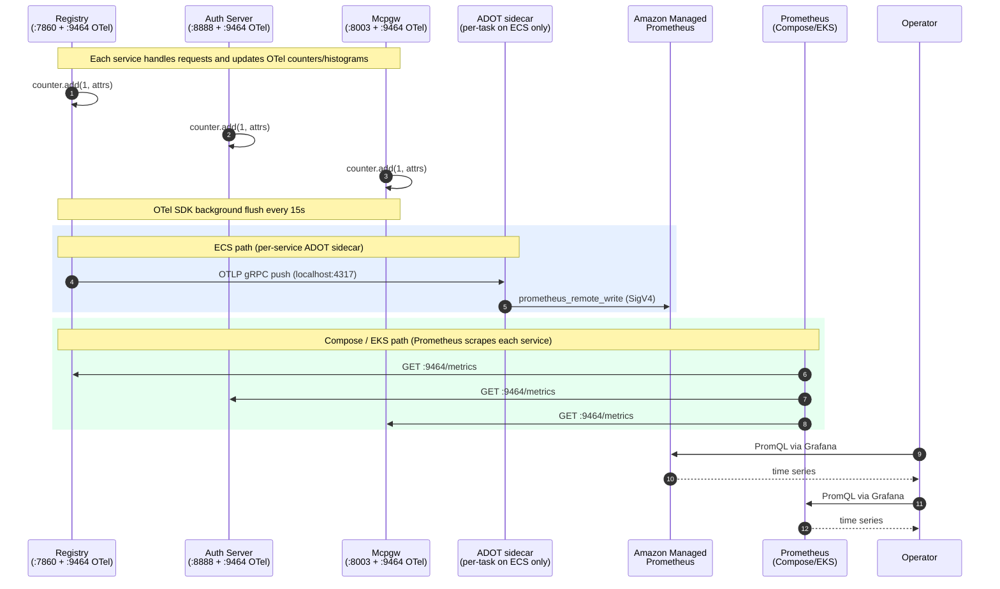

# MCP Gateway Metrics Architecture

Technical reference for the MCP Gateway observability system. For the operator-facing
configuration guide and PromQL cookbook, see [OBSERVABILITY.md](OBSERVABILITY.md).

## Overview

Each application service (registry, auth-server, mcpgw) emits metrics in-process
via the OpenTelemetry SDK.

### Key Properties

- **Zero-network emission**: `Counter.add(1, attrs)` is a sub-microsecond memory write
- **Standard OTel SDK**: Prometheus exporter on `:9464`, optional OTLP push export
- **Bounded cardinality**: Attributes pruned to a safe set (no unbounded user/query labels)
- **Three deployment surfaces**: Docker Compose (Prometheus scrape), ECS (ADOT sidecar to AMP), EKS (in-cluster Prometheus with NetworkPolicy)

## Architecture

### End-to-End Flow



### Component View

```
+--------------------------------------------------------------------+
|           Registry / Auth-Server / Mcpgw (each process)            |
|                                                                    |
|  OpenTelemetry SDK (in-process)                                    |
|   - MeterProvider with PrometheusMetricReader                      |
|   - Optional PeriodicExportingMetricReader (OTLP push)             |
|   - FastAPI auto-instrumentation (HTTP semantic conventions)        |
|                                                                    |
|  Instruments declared in:                                          |
|   - registry/observability/meters.py                               |
|   - auth_server/observability/meters.py                            |
|   - servers/mcpgw/observability_bootstrap.py                       |
+------------------------------+-------------------------------------+
                               |
              +----------------+----------------+
              |                                 |
    GET :9464/metrics                 OTLP push (when configured)
    (always-on Prometheus exporter)   to OTEL_EXPORTER_OTLP_ENDPOINT
              |                                 |
              v                                 v
    Prometheus (Compose/EKS)          ADOT sidecar (ECS) -> AMP
              |                       or OTel Collector -> vendor
              v
    Grafana (or any PromQL-compatible UI)
```

## Metric Inventory

### Path-2: Business Event Counters and Histograms

These are the primary operational metrics emitted by the middleware layer.

| Instrument | Type | Service | Attributes |
|-----------|------|---------|------------|
| `auth_request_total` | Counter | auth-server, registry | `success`, `method`, `server` |
| `auth_request_duration_seconds` | Histogram | auth-server, registry | `success`, `method`, `server` |
| `tool_execution_total` | Counter | auth-server, registry | `method`, `tool_name`, `success` |
| `tool_execution_duration_seconds` | Histogram | auth-server, registry | `method`, `tool_name`, `success` |
| `tool_discovery_total` | Counter | auth-server, registry | `success`, `resource_type` |
| `tool_discovery_duration_seconds` | Histogram | auth-server, registry | `success`, `resource_type` |
| `registry_operation_total` | Counter | registry | `operation`, `resource_type`, `success` |
| `registry_operation_duration_seconds` | Histogram | registry | `operation`, `resource_type`, `success` |
| `health_check_total` | Counter | auth-server, registry | `success` |
| `health_check_duration_seconds` | Histogram | auth-server, registry | `success` |
| `mcpgw_tool_invocations_total` | Counter | mcpgw | `tool`, `success` |
| `mcpgw_tool_duration_seconds` | Histogram | mcpgw | `tool`, `success` |

### Path-3: In-Process Operational Counters

Previously invisible (declared with `prometheus_client.Counter` and never exported).
Now exposed via OTel instruments with compatibility adapters.

| Instrument | Type | Service |
|-----------|------|---------|
| `nginx_config_writes_total` | Counter | registry |
| `nginx_reload_total` | Counter | registry |
| `nginx_updates_skipped_total` | Counter | registry |
| `peer_sync_total` | Counter | registry |
| `peer_sync_failures_total` | Counter | registry |
| `m2m_orphan_cleanups_total` | Counter | registry |
| `mcp_registry_cloud_detection_total` | Counter | registry |
| `logout_session_cleared_total` | Counter | registry |
| `logout_sso_redirect_total` | Counter | registry |
| `logout_basic_redirect_total` | Counter | registry |
| `logout_session_not_found_total` | Counter | registry |

### HTTP Auto-Instrumentation (via opentelemetry-instrumentation-fastapi)

| Instrument | Type | Services |
|-----------|------|----------|
| `http_server_duration_milliseconds` | Histogram | all |
| `http_server_request_size_bytes` | Histogram | all |
| `http_server_response_size_bytes` | Histogram | all |
| `http_server_active_requests` | UpDownCounter | all |

### Observable Gauge

| Instrument | Type | Service | Notes |
|-----------|------|---------|-------|
| `deployment_mode` | Gauge | registry | Value is always 1; `mode` attribute carries the deployment mode string |

## Emission Paths

### Prometheus Scrape (always on)

Each service starts an HTTP server on `OTEL_EXPORTER_PROMETHEUS_PORT` (default `9464`)
via `opentelemetry-exporter-prometheus`. Prometheus (or any compatible scraper) pulls
metrics in text exposition format.

**Configuration:**

```bash
OTEL_EXPORTER_PROMETHEUS_HOST=0.0.0.0   # Bind address (0.0.0.0 for K8s/ECS)
OTEL_EXPORTER_PROMETHEUS_PORT=9464      # Port for /metrics endpoint
```

### OTLP Push (optional, for ECS or vendor platforms)

When `OTEL_EXPORTER_OTLP_ENDPOINT` is set, the OTel SDK adds a
`PeriodicExportingMetricReader` that pushes OTLP metrics at a configurable interval.

**Configuration:**

```bash
OTEL_EXPORTER_OTLP_ENDPOINT=http://localhost:4317          # ADOT sidecar (ECS)
OTEL_EXPORTER_OTLP_HEADERS=dd-api-key=YOUR_KEY             # For direct vendor push
OTEL_METRIC_EXPORT_INTERVAL_MS=15000                       # Push interval (default 15s)
OTEL_EXPORTER_OTLP_METRICS_TEMPORALITY_PREFERENCE=delta    # Datadog requires delta
```

**Platform-specific endpoints:**

| Platform | Endpoint | Headers | Temporality |
|----------|----------|---------|-------------|
| ADOT sidecar (ECS) | `http://localhost:4317` | (none, SigV4 on sidecar) | `cumulative` |
| Datadog US1 | `https://otlp.datadoghq.com` | `dd-api-key=YOUR_KEY` | `delta` |
| Datadog EU1 | `https://otlp.datadoghq.eu` | `dd-api-key=YOUR_KEY` | `delta` |
| New Relic | `https://otlp.nr-data.net` | `api-key=YOUR_LICENSE_KEY` | `cumulative` |
| Honeycomb | `https://api.honeycomb.io` | `x-honeycomb-team=YOUR_API_KEY` | `cumulative` |
| Grafana Cloud | `https://otlp-gateway-{region}.grafana.net/otlp` | `Authorization=Basic {base64}` | `cumulative` |

### Legacy HTTP POST (transition only, removed in 1.26.0)

When `METRICS_LEGACY_HTTP_POST=true`, the middleware ALSO posts JSON events to
`metrics-service:8890` via the old path. Both emissions run simultaneously.
The `metrics_emission_path_total{path}` counter tracks which paths are active.

## ECS Topology (ADOT Sidecar)

On ECS, each service task includes an ADOT sidecar container:

```
+---------------------------------------------------+
| ECS Task (e.g. registry)                          |
|                                                   |
|  +-----------------+    +----------------------+  |
|  | registry        |    | aws-otel-collector   |  |
|  | (main app)      |    | (ADOT sidecar)       |  |
|  |                 |    |                      |  |
|  | OTLP push ----->|--->| otlp receiver :4317  |  |
|  |                 |    | prometheusremotewrite |  |
|  | Prom :9464      |    |   -> AMP (SigV4)     |  |
|  +-----------------+    +----------------------+  |
|                                                   |
|  CPU: 896 + 128 = 1024 (task limit)              |
|  Mem: 1792 + 256 = 2048 (task limit)             |
+---------------------------------------------------+
```

The ADOT collector config uses:
- **Receiver**: OTLP gRPC on `0.0.0.0:4317` and HTTP on `0.0.0.0:4318`
- **Exporter**: `prometheusremotewrite` with `sigv4auth` to the AMP workspace
- **Pipeline**: `metrics: otlp -> prometheusremotewrite`

IAM policy `adot_amp_write` grants `aps:RemoteWrite` scoped to the specific AMP workspace ARN.

## EKS Topology (Prometheus Scrape + NetworkPolicy)

On EKS, each service pod exposes `:9464` for Prometheus scraping. A `NetworkPolicy`
restricts ingress on that port to pods matching the Prometheus selector.

```yaml
# Rendered from charts/registry/templates/networkpolicy-metrics.yaml
apiVersion: networking.k8s.io/v1
kind: NetworkPolicy
spec:
  podSelector:
    matchLabels:
      app.kubernetes.io/name: registry
  ingress:
    - from:
        - namespaceSelector:
            matchLabels:
              kubernetes.io/metadata.name: monitoring
          podSelector:
            matchLabels:
              app.kubernetes.io/name: prometheus
      ports:
        - port: 9464
          protocol: TCP
```

## Compatibility Layer

`registry/observability/_compat.py` provides adapter classes that wrap OTel instruments
with the legacy `prometheus_client` API (`.labels(...).inc()`, `.observe()`). This allows
gradual migration of call sites without a big-bang rewrite.

| Adapter | Wraps | Legacy API preserved |
|---------|-------|---------------------|
| `_CounterAdapter` | `Counter` | `.labels(**kwargs).inc(amount)` |
| `_HistogramAdapter` | `Histogram` | `.labels(**kwargs).observe(value)` |
| `_UpDownCounterAdapter` | `UpDownCounter` | `.labels(**kwargs).inc()`, `.dec()` |

## Grafana Dashboards

Pre-built dashboard: **MCP Analytics Comprehensive**
(`config/grafana/dashboards/mcp-analytics-comprehensive.json`)

### Key Panels

| Panel | Metric | Description |
|-------|--------|-------------|
| Real-time Protocol Activity | `rate(tool_execution_total[5m])` | MCP method call rates |
| Authentication Flow | `rate(auth_request_total[5m])` | Success/failure by method |
| Auth Success Rate | `sum(rate(...{success="true"})) / sum(rate(...))` | Single stat with thresholds |
| Tool Execution Latency | `histogram_quantile(0.95, ...)` | P50/P95/P99 percentiles |
| Top Tools by Usage | `topk(10, sum by(tool_name)(rate(...)))` | Most called tools |

Dashboard auto-refreshes every 30 seconds with a default 1-hour time range.

## Troubleshooting

**No metrics on `:9464/metrics`?**
- Verify `opentelemetry-exporter-prometheus` is installed in the container
- Check that `OTEL_EXPORTER_PROMETHEUS_PORT` is not conflicting with another process
- Look for `PrometheusMetricReader` initialization in service startup logs

**Metrics appear in Prometheus but not in Grafana dashboards?**
- Verify the Prometheus data source is configured in Grafana
- Check that metric names in dashboard JSON match the OTel instrument names
- On ECS: dashboards query OTel-native names; if auth-server is on legacy path,
  its metrics use `mcp_*` prefix instead

**OTLP push failing?**
- Check for `StatusCode.UNIMPLEMENTED` errors (means the receiver does not support
  that signal type, e.g. traces sent to a metrics-only pipeline)
- Verify `OTEL_EXPORTER_OTLP_ENDPOINT` is reachable from the container
- For ECS ADOT sidecar: check the task role has `aps:RemoteWrite` permission

**Port `:9464` already in use?**
- Each service defaults to port 9464. In Docker Compose this is fine (separate
  containers). If running multiple services on the same host, set
  `OTEL_EXPORTER_PROMETHEUS_PORT` to different values per service.

## Related Documentation

- [OBSERVABILITY.md](OBSERVABILITY.md): Operator guide (configuration, PromQL cookbook, verification)
- [unified-parameter-reference.md](unified-parameter-reference.md): Cross-surface env var mapping