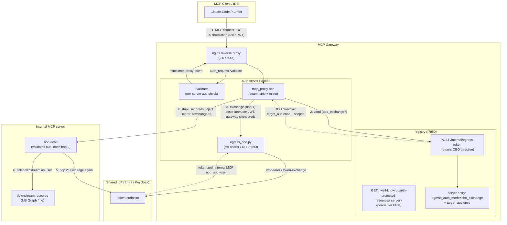
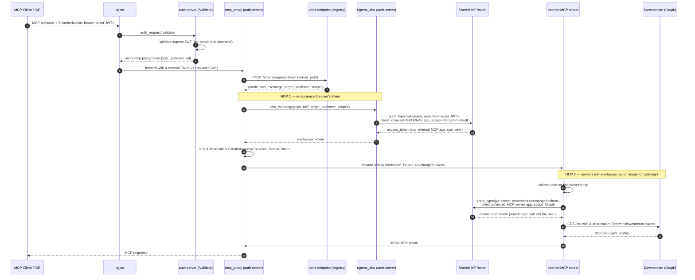

# Same-IdP OBO Token Exchange (`obo_exchange` egress)

*Status: Feature documentation. Per-server opt-in via `egress_auth_mode=obo_exchange`.*

`obo_exchange` is an egress auth mode in which the gateway, instead of injecting a
vaulted third-party token (see [Per-User Egress Credential Vault](egress-credential-vault.md)),
performs an **On-Behalf-Of token exchange at the same IdP** as the gateway. It
takes the user's ingress JWT and re-audiences it (Entra `jwt-bearer` / Keycloak
RFC 8693) to an **internal** MCP server's app, preserving the user's identity.
The forwarded token is itself a valid IdP-signed JWT the MCP server can chain
again (hop 2) for a downstream resource.

Two hops make up the full chain; the gateway does **hop 1**, the MCP server does
**hop 2**:

- **Hop 1 (the gateway):** take the user's ingress JWT, exchange it at the IdP
  (using the gateway's OWN IdP client credentials) for a token audienced to the
  internal MCP server's app, preserving the user's `sub`/`oid`. Strip the user's
  gateway credentials, inject the exchanged token, forward.
- **Hop 2 (the MCP server, out of scope for the gateway):** the server exchanges
  that re-audienced token at the SAME IdP for a downstream resource token (e.g.
  Microsoft Graph) and calls the resource as the user.

This is the same-IdP, stateless sibling of the 3LO vault: no per-user consent, no
token storage, no provider table — the gateway mints a fresh exchanged token per
request. It is for **internal** MCP servers that live in the same tenant/realm as
the gateway.

This document doubles as a **verification runbook**: §2–§3 walk through deploying
a barebones `obo-echo` server (which performs hop 2 against Graph) and exercising
the full chain against the `mcp-entra` Helm release.

---

## Table of Contents

- [Concepts and terminology](#concepts-and-terminology)
- [Architecture](#architecture)
- [Runtime sequence](#runtime-sequence)
- [How `obo_exchange` differs from the 3LO vault](#how-obo_exchange-differs)
- [Registration contract](#registration-contract)
- [The RFC 8707 resource / Entra App ID URI constraint](#resource-constraint)
- [Environment variables](#environment-variables)
- [1. Entra app registration](#1-entra-app-registration)
- [2. Deploy the echo server (no image build)](#2-deploy-the-echo-server-no-image-build)
- [3. Registry setup + exercise](#3-registry-setup--exercise)
- [Failure triage](#failure-triage)
- [Security model](#security-model)

---

## Concepts and terminology

| Term | Meaning |
|------|---------|
| **OBO (on-behalf-of)** | The gateway calls a downstream as the user's delegated identity, not a shared bot. |
| **Hop 1** | The gateway's IdP token exchange: ingress JWT -> token audienced to the internal MCP server's app. |
| **Hop 2** | The MCP server's own exchange of the hop-1 token for a downstream-resource token (server-author's code, not the gateway's). |
| **`egress_auth_mode=obo_exchange`** | Per-server flag selecting this mode instead of `none` / `oauth_user` (3LO vault). |
| **`target_audience`** | The internal MCP server's IdP audience (Entra App ID URI / Keycloak client id) the gateway requests in hop 1. |
| **Ingress token** | The user's JWT presented to the gateway (`X-Authorization`), used as the OBO `assertion`/`subject_token`. Must be a bearer JWT, not a session cookie. |
| **Per-server resource (RFC 8707)** | `https://<gateway>/<server>/mcp` — the resource an MCP client requests at login; must be a registered Entra App ID URI (see [resource constraint](#resource-constraint)). |
| **Egress injection seam** | The shared `mcp_proxy` code (gate -> strip gateway creds -> inject `Authorization`) reused by both `oauth_user` and `obo_exchange`. |

Deployment facts for the verification runbook (`mcp-entra` release):
- Registry API **and** MCP proxy share ONE host
  `https://mcpregistry.agents.example.com`; a server's MCP proxy lives at
  `https://mcpregistry.agents.example.com/<server>/mcp` (a per-server
  nginx location that exists only after the server is registered, §3b).
- Namespace `mcp-entra`; the echo upstream is in-cluster at
  `http://obo-echo.mcp-entra.svc.cluster.local:8000/mcp`.
- `target_audience` MUST differ from the gateway's own `ENTRA_CLIENT_ID`
  (same-app OBO is rejected at registration).

---

## Architecture

The gateway performs hop 1 inline at the `mcp_proxy` hop, reusing the egress
injection seam. Unlike the 3LO vault, there is **no secret store and no consent
facade** — the exchange is stateless and uses the gateway's own IdP credentials.



---

## Runtime sequence

A warm call — no consent, no vault, no storage. The gateway exchanges the ingress
token per request and forwards the result.



Key points:

- **Stateless, per-request.** The hop-1 token bakes in the user's `sub`; it is
  minted fresh each request and never cached/reused across users.
- **The user's gateway credentials never reach the MCP server.** The seam strips
  `Authorization`/`X-Authorization`/`Cookie`/`X-Internal-Token` before injecting
  the exchanged token.
- **The forwarded token is chainable.** Because it is an IdP-signed JWT audienced
  to the MCP server's app, the server can legitimately exchange it again (hop 2).
  A raw 3LO provider token or the internal HS256 proxy token could not.
- **Non-interactive.** Unlike `oauth_user`, there is no consent elicitation; a
  failure is terminal (the agent cannot open a browser mid tool-call).

---

## How `obo_exchange` differs from the 3LO vault

Both modes share the `mcp_proxy` egress injection seam; they differ only in how
the forwarded token is **sourced**.

| Aspect | `oauth_user` (3LO vault) | `obo_exchange` (this doc) |
|--------|--------------------------|----------------------------|
| Token source | Per-user vaulted third-party token | IdP token exchange, minted per request |
| IdP relationship | Third-party provider (GitHub/Google/...) | SAME IdP as the gateway |
| User interaction | One-time browser consent per `(provider, server)` | None (ingress token is the exchange subject) |
| Storage | Secret store (OpenBao / Secrets Manager) + refresh | Stateless — nothing stored |
| Forwarded token | Provider resource token (opaque, not chainable) | IdP JWT re-audienced to the MCP server (chainable for hop 2) |
| Registration | `provider`, `client_id`, `client_secret`, scopes | `target_audience` (+ audience scopes) |
| Credentials used | Per-server operator-supplied OAuth app | The gateway's OWN IdP client credentials |
| Target servers | External SaaS | Internal MCP servers in the same tenant/realm |

---

## Registration contract

An `obo_exchange` server entry needs only:

| Field | Role |
|-------|------|
| `egress_auth_mode = "obo_exchange"` | Selects the exchange path at the seam. |
| `egress_oauth.target_audience` | The internal MCP server's IdP audience (Entra App ID URI / Keycloak client id). The `aud` the gateway requests in hop 1; the value the MCP server validates and chains from. **Required; must differ from the gateway's own client id.** |
| `egress_oauth.scopes` | Audience-scoped scopes for hop 1 (e.g. `["api://<mcp-app>/.default"]`). Optional; defaults to `<target_audience>/.default` for Entra. |

No `provider` / `client_id` / `client_secret` (those are 3LO-only). The MCP-server
author codes hop 2 against two facts the gateway guarantees: the **expected `aud`**
(their own app, which they register as `target_audience`) and the **shared issuer**
(the same IdP — already known).

---

## The RFC 8707 resource / Entra App ID URI constraint

The hardest part of wiring this on Entra with a real MCP client is making three
independent rules agree on ONE resource string:

1. **RFC 9728 §3.3 (client):** an MCP client only accepts a Protected Resource
   Metadata (PRM) `resource` equal to the connection URL it is accessing (or that
   URL's origin). A made-up shared path is rejected.
2. **RFC 8707 (client):** a bare-origin resource is canonicalized with a trailing
   `/` on the wire — which Entra App ID URIs cannot match (Entra forbids a
   trailing slash in `identifierUris`).
3. **Entra:** the `resource` the client sends must equal a registered Application
   ID URI **exactly**, and the requested scope must live under that URI.

The only value satisfying all three is the **per-server connection URL**
`https://<gateway>/<server>/mcp`. The gateway makes this work automatically:

- The 401 on `/<server>/mcp` advertises a **per-server** `WWW-Authenticate:
  resource_metadata=.../.well-known/oauth-protected-resource/<server>/mcp` (nginx
  per-location override, obo servers only).
- That per-server PRM advertises `resource = https://<gateway>/<server>/mcp` and
  scope `.../user_impersonation`, derived dynamically from the registry entry.
- auth-server validates that per-server `aud` (built from the **public** gateway
  URL).

The single manual consequence: each obo server's per-server URL must be in the
gateway app's `identifierUris` array (see [§1f](#1f-add-each-obo-servers-per-server-url-to-the-gateway-apps-identifieruris)).
`GET /api/egress/obo-identifier-uris` returns the exact list. This is the
registry-dynamic / Entra-manual compromise; clients on lenient IdPs
(Keycloak/Cognito) do not hit constraints 2–3.

---

## Environment variables

`obo_exchange` adds **no required env vars** — it is configured per-server in the
registry and uses the gateway's existing IdP credentials. Relevant existing vars:

| Variable | Service | Role for `obo_exchange` |
|----------|---------|--------------------------|
| `ENTRA_CLIENT_ID` / `ENTRA_CLIENT_SECRET` / `ENTRA_TENANT_ID` | auth-server | The gateway's OWN IdP app — used as the calling client in hop 1. Already set for ingress auth. |
| `AUTH_SERVER_EXTERNAL_URL` | auth-server | Public gateway URL; auth-server builds the per-server audience to validate from it (NOT the internal `REGISTRY_URL`). |
| `REGISTRY_URL` | registry | Public gateway URL; the per-server PRM `resource` is built from it. |
| `IDE_OAUTH_CLIENT_ID` / `IDE_OAUTH_CALLBACK_PORT` | registry | Pre-registered public client advertised to IDEs that consume the Connect config (Cursor). Claude Code passes these as CLI flags instead. |
| `MCP_ADVERTISED_SCOPES` | registry | Affects only the gateway-wide root PRM (non-obo discovery). Leave at the chart default; obo uses the per-server PRM. |

---

## 1. Entra app registration

Two apps, same tenant as the gateway. The gateway app already exists (it's the
deploy's `ENTRA_CLIENT_ID`); you create the echo server's app and wire two
permission edges -- one per hop.

> **PREREQUISITE -- verify the gateway's domain in the tenant.** The MCP-client
> login path (3d-alt) needs the gateway's per-server URLs
> (`https://mcpregistry.agents.example.com/<server>/mcp`) registered as
> Application ID URIs (1f). Entra only accepts an `https://` (custom-scheme)
> identifier URI on a **tenant-verified domain** -- otherwise it rejects the URI
> with *"Values of IdentifierUris property must use a verified domain of the
> organization or its subdomain."* So before 1f:
> 1. Entra ID -> **Custom domain names** -> **Add custom domain** -> enter the
>    domain (`example.com`, or the specific subdomain). Needs Global Admin or
>    Domain Name Admin.
> 2. Add the **TXT record** Entra shows (`MS=msXXXXXXXX`) at your DNS provider
>    (e.g. Route 53 for `example.com`), then click **Verify**.
> Verifying the apex (`example.com`) covers subdomains like
> `mcpregistry.agents.example.com`. This is a one-time tenant-wide step;
> the CLI token path (3a) does NOT need it (it mints against any scope without an
> `https://` App ID URI), only the interactive MCP-client path does.

### 1a. Create the echo server's app (the hop-1 target)

1. Entra ID -> App registrations -> New: name `obo-echo-mcp-server`, single tenant.
2. **Expose an API** (its *Application ID URI* becomes `target_audience`):
   - *Expose an API* -> *Add* Application ID URI. Accept `api://<client-id>` or
     set `api://obo-echo-mcp-server`.
   - *Add a scope* with these fields:

     | Field | Value |
     |-------|-------|
     | Scope name | `access_as_user` |
     | (full scope, auto-filled) | `api://<echo-client-id>/access_as_user` |
     | Who can consent? | **Admins and users** |
     | Admin consent display name | `Access obo-echo as the user` |
     | Admin consent description | `Allows the gateway to call the obo-echo MCP server on behalf of the signed-in user.` |
     | User consent display name | `Access obo-echo on your behalf` |
     | User consent description | `Allows the gateway to call the obo-echo MCP server on your behalf.` |
     | State | **Enabled** |

   - **Record the App ID URI** -> used as `target_audience` (registry) and
     `MCP_APP_AUDIENCE` (echo env).
3. **Certificates & secrets** -> *New client secret*. **Record the value** ->
   `MCP_CLIENT_SECRET`. The app's client id -> `MCP_CLIENT_ID`. (Needed for hop 2.)

### 1a-bis. Expose a `user_impersonation` scope on the GATEWAY app

**Why:** the ingress token the agent presents (`X-Authorization`) MUST be
audienced to the gateway app, or Entra rejects the OBO assertion with
`AADSTS50013: Assertion failed signature validation`. The user token is minted
against a scope the gateway app *exposes*; if none exists you get
`AADSTS65005: ... scope 'user_impersonation' that doesn't exist`. So the gateway
app must expose a delegated scope. Do this once on the GATEWAY app (the deploy's
`ENTRA_CLIENT_ID`, e.g. `00000000-0000-0000-0000-000000000000`).

Steps (Azure Portal -> Entra ID -> App registrations -> the gateway app):

1. Open **Expose an API**.
2. If **Application ID URI** is not set, click **Add** at the top and **Save**
   (accept the default `api://<gateway-client-id>`). If already set, note it.
3. Click **+ Add a scope** and enter:

   | Field | Value |
   |-------|-------|
   | Scope name | `user_impersonation` |
   | (full scope, auto-filled) | `api://<gateway-client-id>/user_impersonation` |
   | Who can consent? | **Admins and users** |
   | Admin consent display name | `Access the MCP gateway as the user` |
   | Admin consent description | `Allows the app to access the MCP gateway on behalf of the signed-in user.` |
   | User consent display name | `Access the MCP gateway on your behalf` |
   | User consent description | `Allows the app to access the MCP gateway on your behalf.` |
   | State | **Enabled** |

4. Click **Add scope**.

`cli/get_user_token.py` defaults to requesting
`api://<ENTRA_CLIENT_ID>/user_impersonation`, so once this scope exists and you
mint with `ENTRA_CLIENT_ID` = the GATEWAY app (3a), the token's `aud` == the
gateway client id -- exactly what the OBO assertion requires.

> If the gateway app already exposes a different scope and you don't want to add
> one, skip this and pass `--scope "api://<gateway-client-id>/<existing-scope>
> openid profile email"` to `get_user_token.py` in 3a instead.

### 1b. Hop-1 edge: gateway app -> echo API

So Entra will issue the gateway a token audienced to the echo server.

- Gateway app -> *API permissions* -> *Add a permission* -> select the echo API
  -> *Delegated* -> `access_as_user` -> Add.
  - The echo API only shows under *My APIs* if you OWN it. If it's missing there,
    use the **APIs my organization uses** tab and search by name
    (`obo-echo-mcp-server`) or client id (`11111111-1111-1111-1111-111111111111`). Alternatively add
    yourself as an Owner of the echo app, then it appears under *My APIs*.
  - If it's in neither tab, the scope didn't save -- recheck *Expose an API*.
- **Grant admin consent** for the tenant.

### 1c. Hop-2 edge: echo app -> Microsoft Graph

So the echo server can exchange its token for a Graph token on the user's behalf.

- Echo app (`obo-echo-mcp-server`) -> *API permissions* -> *Add* ->
  *Microsoft Graph* -> *Delegated permissions* -> `User.Read` -> Add.
- **Grant admin consent** for the tenant. (`User.Read` is usually consentable by
  users too, but admin consent avoids an interactive prompt during the silent
  hop-2 exchange.)

> Delegated (not application) permissions on Graph are required: `jwt-bearer` OBO
> mints delegated tokens. An application-permission-only app fails hop 2.

### 1d. The ingress token's audience (per-server resource)

This is the crux. The ingress token's `aud` MUST equal the resource Entra was
asked for, which (for the MCP-client flow) is the PER-SERVER resource
`https://<gw>/<server>/mcp` -- see 3d-alt for the full chain. The gateway makes
this automatic; the only requirements are:

1. **The gateway app exposes a `user_impersonation` scope** (1a-bis). It is shared
   across all obo servers via its stable permission id.
2. **Each obo server's per-server URL is in the gateway app's `identifierUris`**
   (the manual Entra step; see 3d-alt and `GET /api/egress/obo-identifier-uris`).

No `MCP_ADVERTISED_SCOPES` tuning is needed for obo: the per-server PRM advertises
the correct per-server `resource` + scope dynamically from the registry entry.
(`MCP_ADVERTISED_SCOPES` only affects the gateway-wide root PRM used by non-obo
discovery; leave it at the chart default `profile email offline_access`.)

> For the CLI token path (3a) the `aud` is whatever resource you mint against via
> `--scope`; for the MCP-client path it is the per-server resource the client
> derives from its connection URL. Both are validated by auth_server's dynamic
> per-server audience check (`_obo_extra_audiences`, built from the public
> gateway URL).

### 1e. An OAuth client app for the MCP client (Claude)

Entra has **no Dynamic Client Registration**, so the MCP client cannot
self-register -- it needs a pre-provisioned OAuth client_id to run PKCE against,
advertised by the gateway via `IDE_OAUTH_CLIENT_ID`. Two ways to provide it:

#### Option A -- separate public client app (keeps the gateway app confidential)

Recommended when you do NOT want public-client flows enabled on the production
gateway app. The public-flow toggle lives on a dedicated client instead.

1. App registrations -> New -> name `mcp-ide-client`, single tenant.
2. **Authentication** -> *Add a platform* -> *Mobile and desktop applications* ->
   add the loopback redirect URI **`http://localhost:8080/callback`**.
   - You choose the port (8080 here); Entra matches `redirect_uri` literally, so
     it must equal what the client uses. The path is `/callback` (hardcoded by
     Claude Code). Pick a free high port and use it consistently below.
3. **Authentication** -> *Advanced settings* -> **Allow public client flows = Yes**
   (on THIS app, not the gateway).
4. **API permissions** -> *Add* -> the gateway API (`00000000-...`) -> *Delegated*
   -> `user_impersonation` -> Add -> **Grant admin consent**.
5. Record this app's **client id** -> `IDE_OAUTH_CLIENT_ID`.

Wire it into the gateway:
```bash
kubectl set env deploy/registry -n mcp-entra -c registry \
  IDE_OAUTH_CLIENT_ID=<mcp-ide-client client id>
kubectl rollout status deploy/registry -n mcp-entra
```

#### Option B -- reuse the gateway app as the IDE client (one app, but loosens it)

Simpler (no second app), but REQUIRES enabling public-client flows on the
production gateway app `00000000-...`. Only choose this if that is acceptable for
your environment.

1. Gateway app `00000000-...` -> **Authentication** -> *Add a platform* ->
   *Mobile and desktop applications* -> add the loopback redirect URIs.
2. **Authentication** -> *Advanced settings* -> **Allow public client flows = Yes**.
   (The gateway app keeps its client secret for auth_server's server-side use;
   this only additionally permits the interactive public flow.)
3. The gateway already exposes `user_impersonation` and the user is in the tenant,
   so no extra permission grant is needed -- it is requesting its own API.
4. Wire its own id as the IDE client:
```bash
kubectl set env deploy/registry -n mcp-entra -c registry \
  IDE_OAUTH_CLIENT_ID=00000000-0000-0000-0000-000000000000
kubectl rollout status deploy/registry -n mcp-entra
```

**Trade-off:** Option A isolates the public-flow risk to a throwaway dev app and
keeps the gateway app purely confidential (production-correct). Option B avoids a
second app but enables public-client flows on the gateway app itself.

### 1f. Add each obo server's per-server URL to the gateway app's `identifierUris`

**Required for the MCP-client login path (3d-alt), one entry per obo server.**
An MCP client sends an RFC 8707 `resource` equal to its connection URL
(`https://<gw>/<server>/mcp`), and Entra requires that `resource` to be a
registered Application ID URI on the gateway app, or it rejects the auth request
with `AADSTS9010010`. So every obo server's per-server URL must be in the gateway
app's `identifierUris` array.

- `identifierUris` is an **array** (the *Expose an API* blade shows only one;
  edit the array via **App registration -> Manifest**). Add one line per obo
  server; existing entries keep working -- you append, never replace.
- The exact values to register are produced by the registry:
  ```bash
  # admin-authenticated; returns {"identifier_uris": [...], "count": N}
  curl -ksS https://mcpregistry.agents.example.com/api/egress/obo-identifier-uris \
    -H "Authorization: Bearer $JWT" | jq
  ```
- For the echo server the entry is
  `https://mcpregistry.agents.example.com/obo-echo/mcp`. Example manifest:
  ```json
  "identifierUris": [
      "https://mcpregistry.agents.example.com",
      "https://mcpregistry.agents.example.com/obo-echo/mcp"
  ]
  ```
- The shared `user_impersonation` scope (1a-bis) resolves under each of these
  URIs via its stable permission id -- no per-server scope or re-consent needed.
- **Do this AFTER registering the server (3b)** so its path exists, and BEFORE
  the client connects (3d-alt). The registry side is automatic (per-server PRM +
  audience validation); this array is the one manual Entra step per obo server.

> Scaling note: Entra caps `identifierUris` (historically ~50 per app). Fine for
> tens of obo servers; a deployment with hundreds would need the token-broker
> approach (out of scope here).

Summary of what you recorded:
| Value | Used as | Where |
|-------|---------|-------|
| Echo App ID URI (`api://obo-echo-mcp-server`) | `target_audience` / `MCP_APP_AUDIENCE` | registry config + echo env |
| Echo app client id | `MCP_CLIENT_ID` | echo Secret (hop 2) |
| Echo app client secret | `MCP_CLIENT_SECRET` | echo Secret (hop 2) |
| Tenant id | `IDP_TOKEN_URL` tenant segment | echo env (hop 2) |
| Per-server URL (`https://<gw>/obo-echo/mcp`) | gateway app `identifierUris` entry | Entra (1f), per obo server |

---

## 2. Deploy the echo server (no image build)

Files in this dir: `obo_echo_server.py`, `obo-echo-k8s.yaml`.

```bash
cd .scratchpad/obo-verify
NS=mcp-entra

# 1. server source as a ConfigMap (re-run to update the code).
kubectl create configmap obo-echo-src \
  --from-file=obo_echo_server.py -n $NS \
  --dry-run=client -o yaml | kubectl apply -f -

# 2. hop-2 credentials as a Secret (echo app from step 1a).
kubectl create secret generic obo-echo-hop2 -n $NS \
  --from-literal=MCP_CLIENT_ID='<echo app client id>' \
  --from-literal=MCP_CLIENT_SECRET='<echo app client secret>' \
  --dry-run=client -o yaml | kubectl apply -f -

# 3. edit obo-echo-k8s.yaml env:
#      MCP_APP_AUDIENCE -> your App ID URI
#      IDP_TOKEN_URL    -> replace REPLACE_TENANT_ID
kubectl apply -f obo-echo-k8s.yaml
kubectl rollout status deploy/obo-echo -n $NS   # first start is slow (pip install)
```

To update the server code later: re-run the `create configmap ... | apply` and
`kubectl rollout restart deploy/obo-echo -n $NS`.

---

## 3. Registry setup + exercise

### 3a. Get a USER token (the OBO subject)

`obo_exchange` requires a delegated **user** JWT on the ingress (an M2M
`client_credentials` token is not chainable and is rejected). Device-code flow:

```bash
export ENTRA_TENANT_ID=<tenant>
export ENTRA_CLIENT_ID=<gateway app client id>    # same app the gateway uses
export ENTRA_CLIENT_SECRET=<gateway app secret>   # if confidential
# Use --output (NOT --stdout > file): this is a device-code flow that PRINTS a
# verification URL + code to stdout and blocks while polling. With `--stdout >
# file` that prompt is redirected into the file and the run looks "hung". With
# --output, the prompt shows in the terminal and only the token is written.
uv run python cli/get_user_token.py --output /tmp/user.jwt
# -> open the printed URL, enter the code, sign in as the test user
JWT=$(cat /tmp/user.jwt)
```

### 3b. Register the echo server

```bash
REG=https://mcpregistry.agents.example.com
curl -sk -X POST "$REG/api/servers/register" \
  -H "Authorization: Bearer $JWT" \
  -F "name=OBO Echo" \
  -F "description=OBO hop-1+hop-2 verification server" \
  -F "path=/obo-echo" \
  -F "proxy_pass_url=http://obo-echo.mcp-entra.svc.cluster.local:8000/mcp" \
  -F "transport=streamable-http"
```

### 3c. Configure obo_exchange egress (admin)

`target_audience` = the echo App ID URI from 1a. Must differ from the gateway's
own `ENTRA_CLIENT_ID`.

**UI:** edit the server in the Dashboard -> *Egress Auth* -> Mode
**OBO exchange (same IdP)** -> enter the Target Audience -> Save.

**API (equivalent):**

```bash
curl -sk -X POST "$REG/api/servers/obo-echo/egress-auth" \
  -H "Authorization: Bearer $JWT" -H "Content-Type: application/json" \
  -d '{"egress_auth_mode":"obo_exchange","target_audience":"api://obo-echo-mcp-server","scopes":[]}'
# 200 with egress_auth_mode=obo_exchange + target_audience echoed.
# 400 "must differ from the gateway's own IdP client id" => you used the gateway
#     app id; use the echo server's App ID URI.

curl -sk "$REG/api/servers/obo-echo/egress-auth" -H "Authorization: Bearer $JWT" | jq
```

### 3d. Exercise the tool through the gateway

```bash
# Same host as the registry API; the /obo-echo/ location exists only after 3b.
GW=https://mcpregistry.agents.example.com
curl -ksS -i -X POST "$GW/obo-echo/mcp" \
  -H "X-Authorization: Bearer $JWT" \
  -H "Content-Type: application/json" \
  -H "Accept: application/json, text/event-stream" \
  -d '{"jsonrpc":"2.0","id":1,"method":"tools/call","params":{"name":"whoami","arguments":{}}}'
```

### 3d-alt. Exercise via an MCP client (Claude Code)

> **WORKING on Entra end-to-end (2026-06-25)** via the per-server PRM. Claude Code
> discovers OAuth, logs in via browser PKCE, gets a gateway-audienced token, and
> the gateway performs OBO hop 1 -> the echo server does hop 2. No CLI token.
>
> **How it works (the per-server resource chain).** The hard part was making three
> independent constraints agree on ONE resource string:
>   - RFC 9728 §3.3: the client only accepts a PRM `resource` equal to the
>     connection URL it is accessing (a made-up shared path is rejected).
>   - RFC 8707: a bare-origin resource gets a trailing `/` on the wire, which
>     Entra App ID URIs cannot match (Entra forbids a trailing slash).
>   - Entra: the `resource` the client sends must equal a registered App ID URI
>     exactly, and the requested scope must live under that URI.
>   The only value satisfying all three is the **per-server connection URL**
>   (`https://gw/<server>/mcp`). The gateway now advertises exactly that:
>     1. The 401 on `/<server>/mcp` emits a PER-SERVER
>        `WWW-Authenticate: resource_metadata=<gw>/.well-known/oauth-protected-resource/<server>/mcp`
>        (nginx per-location `set $mcp_resource_metadata`, obo servers only).
>     2. That per-server PRM advertises `resource = <gw>/<server>/mcp` and
>        `scope = <gw>/<server>/mcp/user_impersonation` (dynamic, from the registry).
>     3. Claude sends `resource=<gw>/<server>/mcp` verbatim (has a path -> no
>        trailing-slash) + that scope -> Entra matches the App ID URI -> token
>        `aud = <gw>/<server>/mcp`.
>     4. auth_server validates that per-server `aud` (built from the PUBLIC
>        gateway URL, `_obo_extra_audiences`) -> OBO hop 1 -> hop 2.
>
> **Operator's only manual step: keep Entra's `identifierUris` in sync.** Each obo
> server's per-server URL (`https://gw/<server>/mcp`) must be one of the gateway
> app's `identifierUris` (it is an array -- add one line per obo server, edit via
> App registration -> Manifest). `GET /api/egress/obo-identifier-uris` returns the
> exact list the registry expects. The `user_impersonation` scope is shared (its
> stable permission id), so no per-server scope or re-consent is needed.

Claude Code (Entra has no DCR, so pass the pre-registered public client id +
the fixed callback port that matches the redirect URI from 1e; public client ->
NO `--client-secret`):
```bash
claude mcp add --transport http \
  --client-id <mcp-ide-client client id> \
  --callback-port 8080 \
  obo-echo https://mcpregistry.agents.exmaple.com/obo-echo/mcp
# Then run /mcp inside Claude Code to trigger the browser PKCE login. After
# consent Claude holds a gateway-audienced token and calls through the gateway
# (which performs OBO hop 1). Ask it to run the server's `whoami` tool.
```

Notes:
- Claude Code takes `--client-id`/`--callback-port` on the CLI (it does NOT read
  the gateway's `IDE_OAUTH_CLIENT_ID`/`IDE_OAUTH_CALLBACK_PORT`; those are for
  IDEs like Cursor that consume the gateway Connect config). The redirect URI
  `http://localhost:8080/callback` must be registered on the client app (1e).
- Without `--client-id` Claude Code attempts Dynamic Client Registration and
  fails on Entra with "Incompatible auth server: does not support dynamic client
  registration."

What to confirm: the `whoami` tool result shows the same `hop1`/`hop2` success
fields as below. The only difference from 3d is WHERE the ingress token came from
(the client's PKCE login vs a hand-minted `$JWT`); the gateway behavior is
identical. If you get `AADSTS9010010`, the client's `resource` did not match an
Entra App ID URI -- confirm the per-server URL (`https://<gw>/<server>/mcp`) is in
the gateway app's `identifierUris` (3d-alt) and the 401 advertises the per-server
`resource_metadata` (`curl -i .../<server>/mcp` -> check the WWW-Authenticate).

### What success looks like

The `whoami` result has `hop1` and `hop2`:

**hop1** (the gateway re-audienced correctly):
- `aud` == `target_audience` (`api://obo-echo-mcp-server`) — not the gateway.
- `aud_matches: true`.
- `sub` / `preferred_username` == the USER who minted the ingress token.
- `appid` == the gateway's Entra client id (the calling app on hop 1).

**hop2** (the echo server chained it):
- `exchanged: true`.
- `downstream_oid_matches_hop1: true` — the user's identity survived hop 2.
  (Compare `oid`, NOT `sub`: Entra `sub` is pairwise/audience-scoped and
  legitimately differs between the hop-1 and hop-2 tokens for the same user;
  `oid` is the stable cross-resource user id.)
- `downstream_aud` == `https://graph.microsoft.com` (or `00000003-0000-0000-...`).
- `downstream_call.userPrincipalName` == the same user — the chained Graph token
  actually worked against `GET /me`.

> **VERIFIED end-to-end on the mcp-entra deployment (2026-06-25).** A device-code
> user token (aud=`https://mcpregistry.agents.example.com`, minted via the
> public `mcp-ide-client` app to avoid the confidential-client device-code block)
> drove `whoami` through the gateway: hop1 `aud_matches: true` (re-audienced to
> `api://11111111-...`, appid=gateway), hop2 `exchanged: true` calling Graph
> `/me` as the same user (oid matched). The OBO feature works. Token capture used
> the CLI device-code path; the MCP-client (Claude) login path remains the
> documented Entra `resource`-binding gap (3d-alt), independent of OBO.

### Failure triage

| Symptom | Meaning | Fix |
|---------|---------|-----|
| JSON-RPC `obo_exchange_failed`, `invalid_grant` | HOP 1: gateway app not granted the echo API / user lacks scope / ingress JWT expired | step 1b consent; re-mint user token (3a) |
| `obo_exchange_failed`, `interaction_required` | HOP 1: echo app not admin-consented | grant admin consent (1b) |
| `obo_exchange_failed`, `AADSTS50013 ... signature validation` | HOP 1: the ingress token's `aud` is NOT the gateway app (it's Graph/echo/other) | the token must be minted against the gateway's `user_impersonation` scope -- check 1d (advertised scope) and that the client requested it |
| `obo_exchange_failed`, "requires a bearer JWT" | session cookie / no `X-Authorization` / M2M token | use a delegated USER bearer token (MCP-client PKCE login, 3d-alt) in `X-Authorization` |
| MCP client never prompts for login / can't register | no `IDE_OAUTH_CLIENT_ID` advertised, and Entra has no DCR | set `IDE_OAUTH_CLIENT_ID` (step 1e, Option A or B) |
| `AADSTS65005 ... scope ... doesn't exist` when minting | gateway app does not expose `user_impersonation` | step 1a-bis |
| `AADSTS7000218 ... client_assertion or client_secret` (CLI device-code) | gateway app is confidential; device-code needs the secret or public flows | pass `ENTRA_CLIENT_SECRET` to the patched CLI, OR use the MCP-client path (3d-alt) instead |
| 400 at 3c "must differ from the gateway's own" | `target_audience` == gateway client id | use the echo App ID URI |
| hop1 ok but `hop2.error` `invalid_grant`/`AADSTS65001` | HOP 2: echo app lacks Graph `User.Read` delegated consent | step 1c consent |
| hop1 `aud` == gateway app id (not target) | hop-1 exchange did not run | confirm 3c returned `obo_exchange`; check auth_server logs |

### Logs

```bash
# Gateway hop-1 seam:
kubectl logs -n mcp-entra -l app=auth-server --tail=100 | grep -i obo
# Echo server hop-1 claims + hop-2 result:
kubectl logs -n mcp-entra -l app=obo-echo --tail=80
```

---

## Security model

- **User identity preserved (audit).** The user's `sub`/`oid` carries through hop
  1 (and hop 2). Compare `oid`, not `sub`, across hops: Entra `sub` is
  pairwise/audience-scoped and legitimately differs per resource for the same user.
- **No credential sharing.** The user never gives their token to the MCP server.
  The seam strips the user's gateway credentials (`Authorization`,
  `X-Authorization`, `Cookie`, `X-Internal-Token`, `X-User*`) before injecting the
  exchanged token, so the MCP server sees only the re-audienced OBO token.
- **Least privilege per hop, bounded by app grants.** Hop 1 requests
  `<target>/.default` — every delegated permission the gateway app holds on the
  MCP server's API. Tighter scoping requires listing explicit scopes rather than
  `.default`; privilege is otherwise bounded by the app-registration grants.
- **Stateless mint is a hard invariant.** The hop-1 token bakes in the user's
  `sub`; it is minted per request and never cached or reused across users. A
  cache-key bug would be privilege escalation; the `obo_exchange` branch shares no
  cache with the `oauth_user` vault.
- **Closed audience allowlist.** auth-server accepts a per-server `aud` only for
  the registered obo server being accessed (derived from the request path + the
  public gateway URL), never a wildcard.
- **Session-cookie / M2M callers are rejected.** OBO requires a bearer JWT as the
  exchange subject; a session-cookie or non-chainable token yields a terminal
  error, not a silent pass-through.
- **Same-app exchange rejected at registration.** `target_audience` must differ
  from the gateway's own client id (Entra rejects an OBO assertion whose `aud`
  equals the requested resource).

### Related documentation

- [Per-User Egress Credential Vault (Third-Party OBO)](egress-credential-vault.md)
  — the 3LO (`oauth_user`) sibling mode that shares the egress injection seam.
- [Connection methods: pre-registered client id](connection-methods/client-id.md)
  — IDE OAuth client setup and the Entra DCR/`resource` notes.
